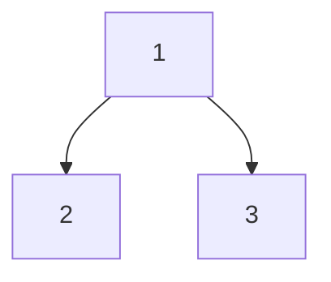
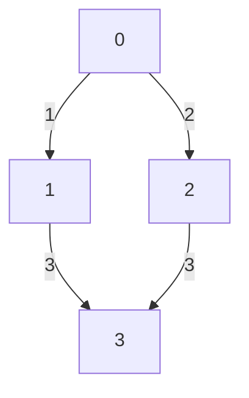

# Chapter 4: Key Algorithm Topics

[Tiếng Việt](index.md)

---

## 1. Binary Search

**Definition:**
- Binary search is an algorithm for finding a target value within a sorted array by repeatedly dividing the search interval in half.

**When to use?**
- When the array is sorted.
- When you need fast search (O(log n)).

**Pros:**
- Fast, simple, efficient for large data.

**Cons:**
- Only works on sorted arrays.

**Example:**
```python
arr = [1, 3, 5, 7, 9, 11]
def binary_search(arr, target):
    l, r = 0, len(arr)-1
    while l <= r:
        mid = (l + r) // 2
        if arr[mid] == target:
            return mid
        elif arr[mid] < target:
            l = mid + 1
        else:
            r = mid - 1
    return -1
print(binary_search(arr, 7))  # 3
```

**Mermaid:**
```mermaid
graph TD
    A[Start] --> B{l <= r?}
    B -- No --> C[Return -1]
    B -- Yes --> D[Calculate mid]
    D --> E{arr[mid] == target?}
    E -- Yes --> F[Return mid]
    E -- No --> G{arr[mid] < target?}
    G -- Yes --> H[l = mid+1]
    G -- No --> I[r = mid-1]
    H --> B
    I --> B
```

---

## 2. Sorting

### QuickSort
- **Idea:** Choose a pivot, partition the array into elements less than/greater than the pivot, recursively sort.
- **When to use?** When you need fast, non-stable sort.
- **Pros:** Average O(n log n), simple to implement.
- **Cons:** Worst case O(n^2), not stable.
- **Example:**
```python
def quicksort(arr):
    if len(arr) <= 1:
        return arr
    pivot = arr[len(arr)//2]
    left = [x for x in arr if x < pivot]
    middle = [x for x in arr if x == pivot]
    right = [x for x in arr if x > pivot]
    return quicksort(left) + middle + quicksort(right)
print(quicksort([3,6,8,10,1,2,1]))
```

### MergeSort
- **Idea:** Divide the array into two halves, sort each half, then merge.
- **When to use?** When you need stable sort, large data.
- **Pros:** O(n log n), stable.
- **Cons:** Uses extra memory.
- **Example:**
```python
def merge_sort(arr):
    if len(arr) <= 1:
        return arr
    mid = len(arr)//2
    left = merge_sort(arr[:mid])
    right = merge_sort(arr[mid:])
    res = []
    i = j = 0
    while i < len(left) and j < len(right):
        if left[i] < right[j]:
            res.append(left[i])
            i += 1
        else:
            res.append(right[j])
            j += 1
    res.extend(left[i:])
    res.extend(right[j:])
    return res
print(merge_sort([3,6,8,10,1,2,1]))
```

### HeapSort
- **Idea:** Build a heap, repeatedly extract the largest/smallest element from the heap.
- **When to use?** When you need in-place, non-stable sort.
- **Pros:** O(n log n), low extra memory.
- **Cons:** Not stable, more complex than merge sort.
- **Example:**
```python
import heapq
def heapsort(arr):
    h = []
    for v in arr:
        heapq.heappush(h, v)
    return [heapq.heappop(h) for _ in range(len(h))]
print(heapsort([3,6,8,10,1,2,1]))
```

---

## 3. Recursion & Backtracking

**Recursion:**
- A function calls itself to solve smaller subproblems.
- **Example:** Factorial
```python
def factorial(n):
    if n == 0:
        return 1
    return n * factorial(n-1)
print(factorial(5))  # 120
```

**Backtracking:**
- Try all possibilities, backtrack when hitting a dead end.
- **Example:** Generate all permutations of an array
```python
def permute(nums):
    res = []
    def backtrack(path, used):
        if len(path) == len(nums):
            res.append(path[:])
            return
        for i in range(len(nums)):
            if used[i]: continue
            used[i] = True
            path.append(nums[i])
            backtrack(path, used)
            path.pop()
            used[i] = False
    backtrack([], [False]*len(nums))
    return res
print(permute([1,2,3]))
```

---

## 4. Dynamic Programming

**Definition:**
- Break the problem into subproblems, store results to avoid recomputation.

**When to use?**
- When the problem has overlapping subproblems and optimal substructure.

**Pros:**
- Reduces computation time, solves complex problems.

**Cons:**
- Uses extra memory, can be hard to identify DP problems.

**Example:** Fibonacci sequence (bottom-up)
```python
def fib(n):
    if n <= 1: return n
    dp = [0, 1]
    for i in range(2, n+1):
        dp.append(dp[-1] + dp[-2])
    return dp[n]
print(fib(10))  # 55
```

**Mermaid:**
```mermaid
graph TD
    A[Fib(n)] --> B[Fib(n-1)]
    A --> C[Fib(n-2)]
    B --> D[Fib(n-2)]
    B --> E[Fib(n-3)]
    C --> F[Fib(n-3)]
    C --> G[Fib(n-4)]
```

---

## 5. Tree (BST, Traversal)

**Definition:**
- A tree is a hierarchical data structure with nodes, each node can have multiple children.

**When to use?**
- When storing hierarchical data (file system, organization, math expressions).

**Pros:**
- Fast search, insert, delete (BST).

**Cons:**
- Need to manage pointers, can be error-prone for complex operations.

**Example:** Preorder traversal
```python
class Node:
    def __init__(self, val):
        self.val = val
        self.left = self.right = None

def preorder(root):
    if not root: return
    print(root.val)
    preorder(root.left)
    preorder(root.right)
# Build and traverse tree
root = Node(1)
root.left = Node(2)
root.right = Node(3)
preorder(root)
```

**Mermaid:**


---

## 6. Graph (BFS, DFS, Dijkstra, Topo sort)

**Definition:**
- A graph consists of nodes (vertices) and edges, can be directed or undirected.

**When to use?**
- When modeling complex relationships (social networks, maps, workflows).

**Pros:**
- Flexible, models many real-world problems.

**Cons:**
- Complex to implement, risk of infinite loops.

**Example:** BFS for shortest path
```python
from collections import deque
def bfs(graph, start):
    visited = set([start])
    q = deque([start])
    while q:
        node = q.popleft()
        print(node)
        for neighbor in graph[node]:
            if neighbor not in visited:
                visited.add(neighbor)
                q.append(neighbor)
graph = {0:[1,2], 1:[0,3], 2:[0,3], 3:[1,2]}
bfs(graph, 0)
```

**Mermaid:**


---

## 7. Other Techniques

- **Greedy:** Always choose the best option at each step.
- **Sliding Window:** Optimize for consecutive subarrays/substrings.
- **Bit Manipulation:** Use bitwise operations for optimization.
- **Trie:** Prefix tree for string problems.

**Greedy Example:**
```python
# Coin change with minimum coins
coins = [1,2,5]
amount = 11
coins.sort(reverse=True)
count = 0
for coin in coins:
    while amount >= coin:
        amount -= coin
        count += 1
print(count)  # 3 (5+5+1)
```

**Sliding Window Example:**
```python
# Longest subarray with sum <= S
arr = [1,2,3,4,5]
S = 7
l = 0
cur_sum = 0
max_len = 0
for r in range(len(arr)):
    cur_sum += arr[r]
    while cur_sum > S:
        cur_sum -= arr[l]
        l += 1
    max_len = max(max_len, r-l+1)
print(max_len)  # 3
```

**Bit Manipulation Example:**
```python
# Count number of 1 bits in integer
n = 13  # 1101
count = 0
while n:
    count += n & 1
    n >>= 1
print(count)  # 3
```

**Trie Example:**
```python
class TrieNode:
    def __init__(self):
        self.children = {}
        self.is_end = False
class Trie:
    def __init__(self):
        self.root = TrieNode()
    def insert(self, word):
        node = self.root
        for c in word:
            if c not in node.children:
                node.children[c] = TrieNode()
            node = node.children[c]
        node.is_end = True
    def search(self, word):
        node = self.root
        for c in word:
            if c not in node.children:
                return False
            node = node.children[c]
        return node.is_end
trie = Trie()
trie.insert('leet')
print(trie.search('leet'))  # True
print(trie.search('code'))  # False
```

---

[Previous: Chapter 3 - Roadmap](../03-roadmap/en.md) | [Next: Chapter 5 - System Design](../05-system-design/en.md) 