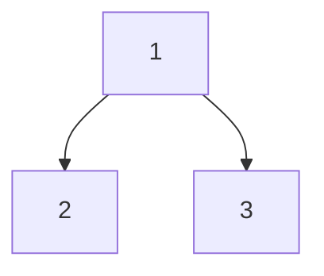
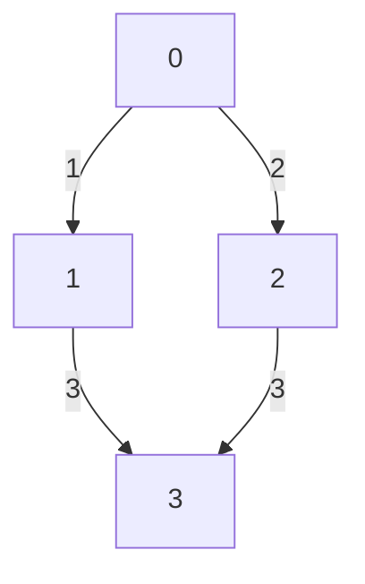

# Chương 4: Các chủ đề thuật toán quan trọng

[English Version](en.md)

---

## 1. Tìm kiếm nhị phân (Binary Search)

**Định nghĩa:**
- Tìm kiếm nhị phân là thuật toán tìm kiếm trên mảng đã sắp xếp bằng cách chia đôi dãy số liên tục cho đến khi tìm thấy hoặc không còn phần tử.

**Khi nào dùng?**
- Khi mảng đã được sắp xếp.
- Khi cần tìm kiếm nhanh (O(log n)).

**Ưu điểm:**
- Nhanh, đơn giản, hiệu quả với dữ liệu lớn.

**Nhược điểm:**
- Chỉ áp dụng cho mảng đã sắp xếp.

**Ví dụ:**
```python
arr = [1, 3, 5, 7, 9, 11]
def binary_search(arr, target):
    l, r = 0, len(arr)-1
    while l <= r:
        mid = (l + r) // 2
        if arr[mid] == target:
            return mid
        elif arr[mid] < target:
            l = mid + 1
        else:
            r = mid - 1
    return -1
print(binary_search(arr, 7))  # 3
```

**Mermaid:**
```mermaid
graph TD
    A[Start] --> B{l <= r?}
    B -- No --> C[Return -1]
    B -- Yes --> D[Calculate mid]
    D --> E{arr[mid] == target?}
    E -- Yes --> F[Return mid]
    E -- No --> G{arr[mid] < target?}
    G -- Yes --> H[l = mid+1]
    G -- No --> I[r = mid-1]
    H --> B
    I --> B
```

---

## 2. Sắp xếp (Sorting)

### QuickSort
- **Ý tưởng:** Chọn một phần tử làm pivot, chia mảng thành hai phần nhỏ hơn/lớn hơn pivot, sắp xếp đệ quy.
- **Khi nào dùng?** Khi cần sắp xếp nhanh, không cần ổn định.
- **Ưu điểm:** Trung bình O(n log n), cài đặt đơn giản.
- **Nhược điểm:** Trường hợp xấu O(n^2), không ổn định.
- **Ví dụ:**
```python
def quicksort(arr):
    if len(arr) <= 1:
        return arr
    pivot = arr[len(arr)//2]
    left = [x for x in arr if x < pivot]
    middle = [x for x in arr if x == pivot]
    right = [x for x in arr if x > pivot]
    return quicksort(left) + middle + quicksort(right)
print(quicksort([3,6,8,10,1,2,1]))
```

### MergeSort
- **Ý tưởng:** Chia mảng thành hai nửa, sắp xếp từng nửa rồi trộn lại.
- **Khi nào dùng?** Khi cần sắp xếp ổn định, dữ liệu lớn.
- **Ưu điểm:** O(n log n), ổn định.
- **Nhược điểm:** Tốn bộ nhớ phụ.
- **Ví dụ:**
```python
def merge_sort(arr):
    if len(arr) <= 1:
        return arr
    mid = len(arr)//2
    left = merge_sort(arr[:mid])
    right = merge_sort(arr[mid:])
    res = []
    i = j = 0
    while i < len(left) and j < len(right):
        if left[i] < right[j]:
            res.append(left[i])
            i += 1
        else:
            res.append(right[j])
            j += 1
    res.extend(left[i:])
    res.extend(right[j:])
    return res
print(merge_sort([3,6,8,10,1,2,1]))
```

### HeapSort
- **Ý tưởng:** Xây dựng heap, liên tục lấy phần tử lớn nhất/nhỏ nhất ra khỏi heap.
- **Khi nào dùng?** Khi cần sắp xếp tại chỗ, không cần ổn định.
- **Ưu điểm:** O(n log n), không cần bộ nhớ phụ lớn.
- **Nhược điểm:** Không ổn định, cài đặt phức tạp hơn merge sort.
- **Ví dụ:**
```python
import heapq
def heapsort(arr):
    h = []
    for v in arr:
        heapq.heappush(h, v)
    return [heapq.heappop(h) for _ in range(len(h))]
print(heapsort([3,6,8,10,1,2,1]))
```

---

## 3. Đệ quy & Quay lui (Recursion & Backtracking)

**Đệ quy:**
- Hàm tự gọi lại chính nó để giải quyết bài toán nhỏ hơn.
- **Ví dụ:** Tính giai thừa
```python
def factorial(n):
    if n == 0:
        return 1
    return n * factorial(n-1)
print(factorial(5))  # 120
```

**Quay lui (Backtracking):**
- Thử tất cả các khả năng, quay lại khi gặp ngõ cụt.
- **Ví dụ:** Sinh tất cả hoán vị của mảng
```python
def permute(nums):
    res = []
    def backtrack(path, used):
        if len(path) == len(nums):
            res.append(path[:])
            return
        for i in range(len(nums)):
            if used[i]: continue
            used[i] = True
            path.append(nums[i])
            backtrack(path, used)
            path.pop()
            used[i] = False
    backtrack([], [False]*len(nums))
    return res
print(permute([1,2,3]))
```

---

## 4. Quy hoạch động (Dynamic Programming)

**Định nghĩa:**
- Chia bài toán thành các bài toán con, lưu kết quả để tránh tính lại.

**Khi nào dùng?**
- Khi bài toán có tính chất con chồng lặp (overlapping subproblems) và tối ưu hóa (optimal substructure).

**Ưu điểm:**
- Giảm thời gian tính toán, giải quyết được nhiều bài toán phức tạp.

**Nhược điểm:**
- Tốn bộ nhớ, khó nhận diện bài toán DP.

**Ví dụ:** Dãy Fibonacci (bottom-up)
```python
def fib(n):
    if n <= 1: return n
    dp = [0, 1]
    for i in range(2, n+1):
        dp.append(dp[-1] + dp[-2])
    return dp[n]
print(fib(10))  # 55
```

**Mermaid:**
```mermaid
graph TD
    A[Fib(n)] --> B[Fib(n-1)]
    A --> C[Fib(n-2)]
    B --> D[Fib(n-2)]
    B --> E[Fib(n-3)]
    C --> F[Fib(n-3)]
    C --> G[Fib(n-4)]
```

---

## 5. Cây (Tree, BST, Traversal)

**Định nghĩa:**
- Cây là cấu trúc dữ liệu phân cấp gồm các node, mỗi node có thể có nhiều node con.

**Khi nào dùng?**
- Khi cần lưu trữ dữ liệu phân cấp (file system, tổ chức, biểu thức toán học).

**Ưu điểm:**
- Tìm kiếm, chèn, xóa nhanh (BST).

**Nhược điểm:**
- Cần quản lý con trỏ, dễ lỗi khi thao tác phức tạp.

**Ví dụ:** Duyệt cây theo thứ tự trước (preorder)
```python
class Node:
    def __init__(self, val):
        self.val = val
        self.left = self.right = None

def preorder(root):
    if not root: return
    print(root.val)
    preorder(root.left)
    preorder(root.right)
# Tạo cây và duyệt
root = Node(1)
root.left = Node(2)
root.right = Node(3)
preorder(root)
```

**Mermaid:**


---

## 6. Đồ thị (Graph, BFS, DFS, Dijkstra, Topo sort)

**Định nghĩa:**
- Đồ thị gồm tập đỉnh (node) và tập cạnh (edge), có thể có hướng hoặc vô hướng.

**Khi nào dùng?**
- Khi mô hình hóa quan hệ phức tạp (mạng xã hội, bản đồ, luồng công việc).

**Ưu điểm:**
- Linh hoạt, biểu diễn nhiều bài toán thực tế.

**Nhược điểm:**
- Cài đặt phức tạp, dễ gặp lỗi vòng lặp vô hạn.

**Ví dụ:** BFS tìm đường đi ngắn nhất
```python
from collections import deque
def bfs(graph, start):
    visited = set([start])
    q = deque([start])
    while q:
        node = q.popleft()
        print(node)
        for neighbor in graph[node]:
            if neighbor not in visited:
                visited.add(neighbor)
                q.append(neighbor)
graph = {0:[1,2], 1:[0,3], 2:[0,3], 3:[1,2]}
bfs(graph, 0)
```

**Mermaid:**


---

## 7. Kỹ thuật khác

- **Greedy:** Luôn chọn phương án tốt nhất tại mỗi bước.
- **Sliding Window:** Tối ưu subarray/substring liên tiếp.
- **Bit Manipulation:** Xử lý bit cho bài toán tối ưu.
- **Trie:** Cây tiền tố cho bài toán chuỗi.

**Ví dụ Greedy:**
```python
# Đổi tiền với số lượng xu ít nhất
coins = [1,2,5]
amount = 11
coins.sort(reverse=True)
count = 0
for coin in coins:
    while amount >= coin:
        amount -= coin
        count += 1
print(count)  # 3 (5+5+1)
```

**Ví dụ Sliding Window:**
```python
# Tìm độ dài dãy con liên tiếp lớn nhất có tổng <= S
arr = [1,2,3,4,5]
S = 7
l = 0
cur_sum = 0
max_len = 0
for r in range(len(arr)):
    cur_sum += arr[r]
    while cur_sum > S:
        cur_sum -= arr[l]
        l += 1
    max_len = max(max_len, r-l+1)
print(max_len)  # 3
```

**Ví dụ Bit Manipulation:**
```python
# Đếm số bit 1 trong số nguyên
n = 13  # 1101
count = 0
while n:
    count += n & 1
    n >>= 1
print(count)  # 3
```

**Ví dụ Trie:**
```python
class TrieNode:
    def __init__(self):
        self.children = {}
        self.is_end = False
class Trie:
    def __init__(self):
        self.root = TrieNode()
    def insert(self, word):
        node = self.root
        for c in word:
            if c not in node.children:
                node.children[c] = TrieNode()
            node = node.children[c]
        node.is_end = True
    def search(self, word):
        node = self.root
        for c in word:
            if c not in node.children:
                return False
            node = node.children[c]
        return node.is_end
trie = Trie()
trie.insert('leet')
print(trie.search('leet'))  # True
print(trie.search('code'))  # False
```

---

[Previous: Chương 3 - Lộ trình học](../03-roadmap/index.md) | [Next: Chương 5 - Thiết kế hệ thống](../05-system-design/index.md) 