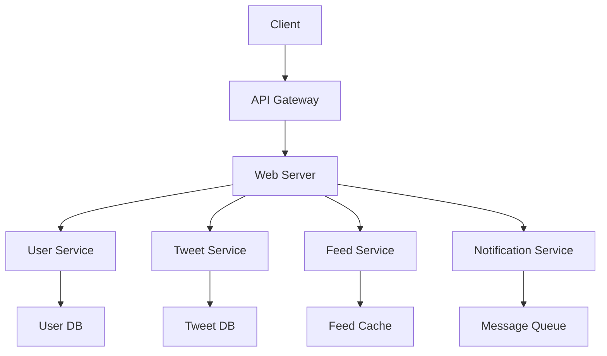

# Chapter 5: System Design

[Tiếng Việt](index.md)

## Overview of System Design

System design is a crucial skill in technical interviews, especially for senior positions. This chapter will help you understand and practice effective system design principles.

---

### 1. System Design Principles

**Scalability**
- **Definition:** The ability of a system to handle growth in users, data, and load.
- **Pros:** Supports growth, prevents downtime, optimizes costs.
- **Cons:** More complex, higher initial costs.
- **When to use?**
  - When anticipating rapid growth
  - When handling concurrent requests
  - When data grows quickly

**High Availability**
- **Definition:** The ability of a system to operate continuously without interruption.
- **Pros:** Increases reliability, reduces downtime, improves user experience.
- **Cons:** Higher costs, more complex.
- **When to use?**
  - When 99.9%+ uptime is required
  - When downtime is costly
  - When fault tolerance is needed

**Security**
- **Definition:** Protecting the system from internal and external threats.
- **Pros:** Protects data, ensures compliance, builds trust.
- **Cons:** Increases complexity, may impact performance.
- **When to use?**
  - When handling sensitive data
  - When compliance is required
  - When protection against attacks is needed

---

### 2. Common Design Patterns

**Microservices**
- **Definition:** Architecture that breaks down applications into independent services.
- **Pros:** Easy to scale, maintainable, technology independent.
- **Cons:** More complex, requires service management.
- **When to use?**
  - When scaling specific components
  - When working with large teams
  - When independent deployment is needed

**Event-Driven Architecture**
- **Definition:** Architecture based on events, components communicate through events.
- **Pros:** Loose coupling, easy to scale, real-time processing.
- **Cons:** Harder to debug, more complex.
- **When to use?**
  - When real-time processing is needed
  - When loose coupling is desired
  - When asynchronous processing is required

**CQRS (Command Query Responsibility Segregation)**
- **Definition:** Separates operations into commands (write) and queries (read).
- **Pros:** Optimizes performance, easy to scale read/write separately.
- **Cons:** More complex, requires data synchronization.
- **When to use?**
  - When read/write ratio is imbalanced
  - When scaling read/write separately
  - When performance optimization is needed

---

### 3. Scalability & Performance

**Horizontal vs Vertical Scaling**
- **Horizontal:** Adding more servers
- **Vertical:** Increasing resources of existing server
- **When to use?**
  - Horizontal: When unlimited scaling is needed
  - Vertical: When application can't be distributed

**Load Balancing**
- **Definition:** Distributing load across servers.
- **Strategies:**
  - Round Robin
  - Least Connections
  - IP Hash
  - Weighted Round Robin

**Caching**
- **Definition:** Temporarily storing data to speed up access.
- **Types of cache:**
  - Application Cache
  - Database Cache
  - CDN Cache
  - Browser Cache

---

### 4. Bottleneck Analysis & Optimization

**Identifying bottlenecks**
- **Monitoring tools:**
  - APM tools
  - Log analysis
  - Performance metrics
  - User feedback

**Database optimization**
- Indexing
- Query optimization
- Connection pooling
- Caching

**Application optimization**
- Code profiling
- Memory management
- Concurrency
- Async processing

---

### 5. Real-world Case Studies

**Twitter-like System**
- Requirements
- High-level design
- Database schema
- API endpoints
- Scaling strategy

**Uber-like System**
- Real-time tracking
- Payment processing
- Location services
- Notification system

**Netflix-like System**
- Video streaming
- Content delivery
- Recommendation system
- User management

## Conclusion

System design is an important skill that requires regular practice. Work through case studies and always consider scalability, availability, and security in your designs.

> "Good system design is about making the right trade-offs."

---

## Advanced Appendix: System Design

### 1. Code Examples for Common Services/Patterns

**Example: API Gateway (Python Flask)**
```python
from flask import Flask, request
app = Flask(__name__)

@app.route('/user/<user_id>')
def get_user(user_id):
    # Forward request to User Service
    return forward_to_service('user', user_id)

@app.route('/order/<order_id>')
def get_order(order_id):
    # Forward request to Order Service
    return forward_to_service('order', order_id)

# ... implement forward_to_service ...
```

**Example: Event Producer (Pseudocode)**
```python
def create_order(order_data):
    save_to_db(order_data)
    event = {'type': 'ORDER_CREATED', 'data': order_data}
    message_queue.publish(event)
```

**Example: Command Handler (CQRS, Pseudocode)**
```python
def handle_command(command):
    if command.type == 'CreateUser':
        user = create_user(command.data)
        event_bus.publish({'type': 'UserCreated', 'data': user})
```

---

### 2. Best Practices for Each Design Pattern

**Microservices**
- Clearly define service boundaries
- Use standard APIs (REST/gRPC) for communication
- Implement automated CI/CD
- Separate health checks and logging per service
- Use service discovery

**Event-Driven**
- Ensure idempotency for consumers
- Use dead-letter queues for errors
- Monitor event lag and latency
- Define clear event schemas

**CQRS**
- Separate read/write models clearly
- Ensure eventual consistency
- Use event sourcing for audit if needed
- Optimize read model for real use cases

---

### 3. Deeper Pros/Cons Analysis & Real-World Examples

| Pattern         | Key Pros                      | Major Cons                    | Real-World Example     |
|----------------|-------------------------------|-------------------------------|------------------------|
| Monolith       | Simple, easy to deploy         | Hard to scale, bottlenecks    | Small apps, MVPs       |
| Microservices  | Scalable, maintainable, independent | Complex, strong DevOps needed | Netflix, Amazon        |
| Event-Driven   | Real-time, loose coupling      | Hard to debug, higher latency | Uber, Slack            |
| CQRS           | Optimized read/write, good audit | Complex, needs data sync      | Banking, e-commerce    |

---

### 4. Detailed Case Study: Twitter System Design

**Requirements:**
- Post tweets, follow users, news feed, large scale

**High-level design:**
- API Gateway → Web Server → Services (User, Tweet, Feed, Notification)
- Databases: User DB, Tweet DB, Feed Cache
- Message Queue for async notifications

**Mermaid:**


**Trade-offs:**
- Feed precompute (faster reads, more storage)
- Async notification (lower latency, more complexity)
- Caching (faster, needs invalidation)

**Sample code: Push Tweet to Feed Cache**
```python
def post_tweet(user_id, tweet):
    save_tweet(user_id, tweet)
    followers = get_followers(user_id)
    for follower in followers:
        feed_cache.push(follower, tweet)
```

---

### 5. Comparison of System Design Patterns

| Criteria         | Monolith      | Microservices | Event-Driven | CQRS         |
|------------------|--------------|--------------|--------------|--------------|
| Simplicity       | ++           | -            | -            | -            |
| Scalability      | -            | ++           | +            | +            |
| Maintainability  | -            | +            | +            | -            |
| Team Independence| -            | ++           | +            | +            |
| Real-time Suitability | -       | +            | ++           | +            |
| Audit/Logging    | +            | +            | +            | ++           |

---

### 6. System Design Interview Checklist

1. Clarify requirements (functional & non-functional)
2. Estimate scale (users, QPS, data size)
3. High-level design (component diagram, data flow)
4. Choose suitable architecture (Monolith/Microservices/Event-Driven...)
5. Database design (schema, index, cache)
6. API design (REST/gRPC, endpoints, rate limiting)
7. Ensure scalability, availability, security
8. Analyze bottlenecks & propose optimizations
9. Discuss trade-offs and justify choices
10. Summarize and answer follow-up questions

---

### 7. Common Pitfalls & Anti-patterns

- Overcomplicating design for small problems
- Ignoring scale/fault tolerance
- No monitoring/logging
- Unstandardized APIs
- Poor service separation
- Over-engineering (using microservices for MVP)
- No plan for data migration
- No backup/recovery plan

---

[Previous: Chapter 4 - Key Algorithm Topics](../04-algorithms/index.md) | [Next: Chapter 6 - Database Optimization](../06-database-optimization/index.md) 