# Chương 5: Thiết kế hệ thống (System Design)

[English Version](en.md)

## Tổng quan về System Design

Thiết kế hệ thống là một kỹ năng quan trọng trong phỏng vấn kỹ thuật, đặc biệt là cho các vị trí senior. Chương này sẽ giúp bạn hiểu và thực hành các nguyên tắc thiết kế hệ thống hiệu quả.

---

### 1. Nguyên tắc thiết kế hệ thống

**Tính khả mở rộng (Scalability)**
- **Định nghĩa:** Khả năng hệ thống xử lý tăng trưởng về lượng người dùng, dữ liệu, và tải.
- **Ưu điểm:** Hỗ trợ tăng trưởng, tránh downtime, tối ưu chi phí.
- **Nhược điểm:** Phức tạp hơn, chi phí ban đầu cao hơn.
- **Khi nào sử dụng?**
  - Khi dự đoán tăng trưởng nhanh
  - Khi cần xử lý nhiều request đồng thời
  - Khi dữ liệu tăng trưởng nhanh

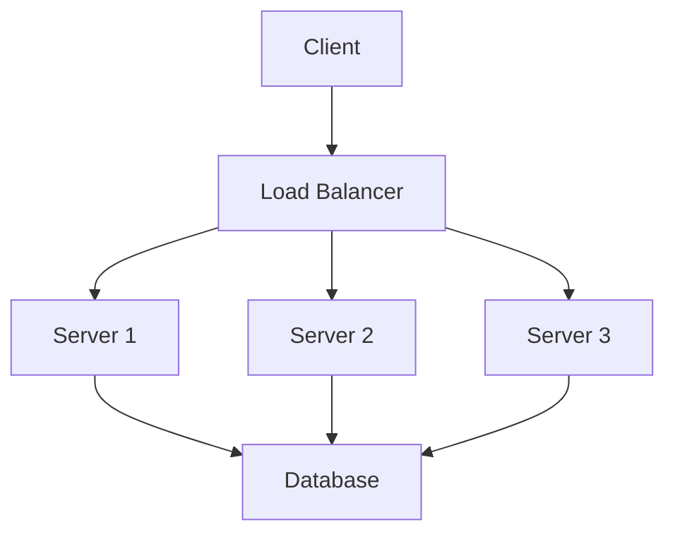

**Tính sẵn sàng cao (High Availability)**
- **Định nghĩa:** Khả năng hệ thống hoạt động liên tục, không bị gián đoạn.
- **Ưu điểm:** Tăng độ tin cậy, giảm downtime, tăng trải nghiệm người dùng.
- **Nhược điểm:** Chi phí cao hơn, phức tạp hơn.
- **Khi nào sử dụng?**
  - Khi cần uptime 99.9% trở lên
  - Khi downtime gây thiệt hại lớn
  - Khi cần fault tolerance

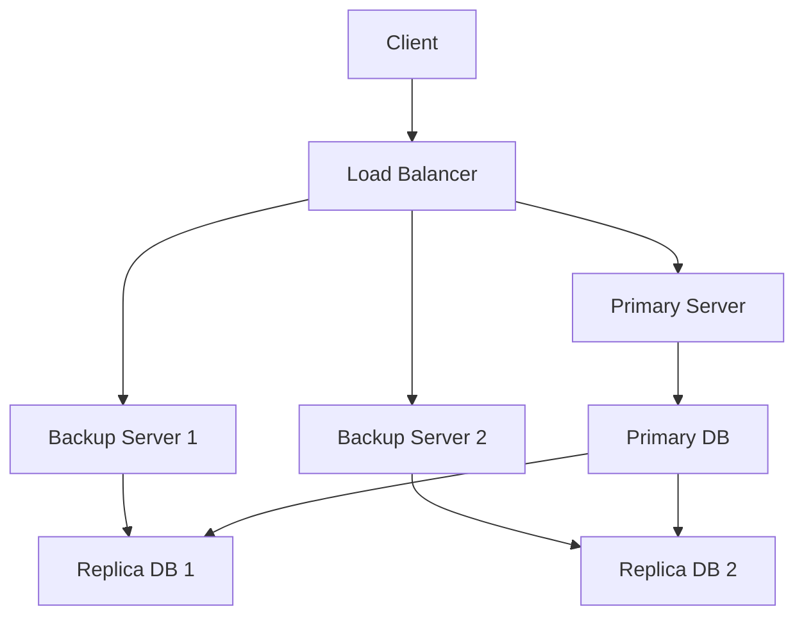

**Tính bảo mật (Security)**
- **Định nghĩa:** Bảo vệ hệ thống khỏi các mối đe dọa bên ngoài và bên trong.
- **Ưu điểm:** Bảo vệ dữ liệu, tuân thủ quy định, tăng niềm tin.
- **Nhược điểm:** Tăng độ phức tạp, có thể ảnh hưởng performance.
- **Khi nào sử dụng?**
  - Khi xử lý dữ liệu nhạy cảm
  - Khi cần tuân thủ các quy định bảo mật
  - Khi cần bảo vệ khỏi tấn công

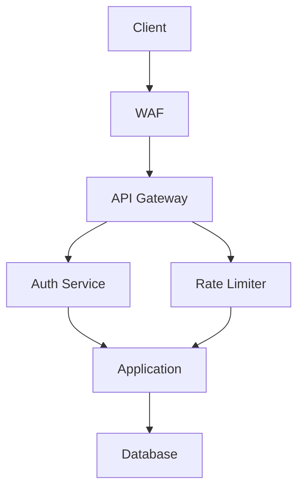

---

### 2. Các mẫu thiết kế phổ biến

**Microservices**
- **Định nghĩa:** Kiến trúc chia nhỏ ứng dụng thành các service độc lập.
- **Ưu điểm:** Dễ scale, dễ maintain, độc lập về công nghệ.
- **Nhược điểm:** Phức tạp hơn, cần quản lý nhiều service.
- **Khi nào sử dụng?**
  - Khi cần scale từng phần riêng biệt
  - Khi team lớn, cần độc lập
  - Khi cần deploy độc lập

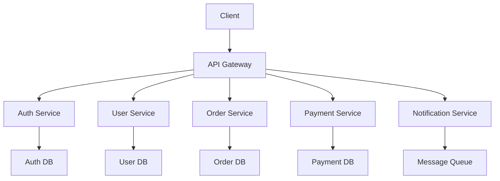

**Các service trong Microservices:**
1. **API Gateway**
   - Route requests
   - Load balancing
   - Authentication
   - Rate limiting
   - Request/Response transformation

2. **Auth Service**
   - User authentication
   - Authorization
   - Token management
   - OAuth integration
   - Session management

3. **User Service**
   - User management
   - Profile management
   - User preferences
   - User search
   - User analytics

4. **Order Service**
   - Order processing
   - Order tracking
   - Order history
   - Order validation
   - Order notifications

5. **Payment Service**
   - Payment processing
   - Payment gateway integration
   - Transaction management
   - Refund handling
   - Payment analytics

6. **Notification Service**
   - Email notifications
   - SMS notifications
   - Push notifications
   - Notification templates
   - Notification tracking

**Event-Driven Architecture**
- **Định nghĩa:** Kiến trúc dựa trên events, các component giao tiếp qua events.
- **Ưu điểm:** Loose coupling, dễ scale, real-time processing.
- **Nhược điểm:** Khó debug, phức tạp hơn.
- **Khi nào sử dụng?**
  - Khi cần xử lý real-time
  - Khi cần loose coupling
  - Khi cần xử lý bất đồng bộ

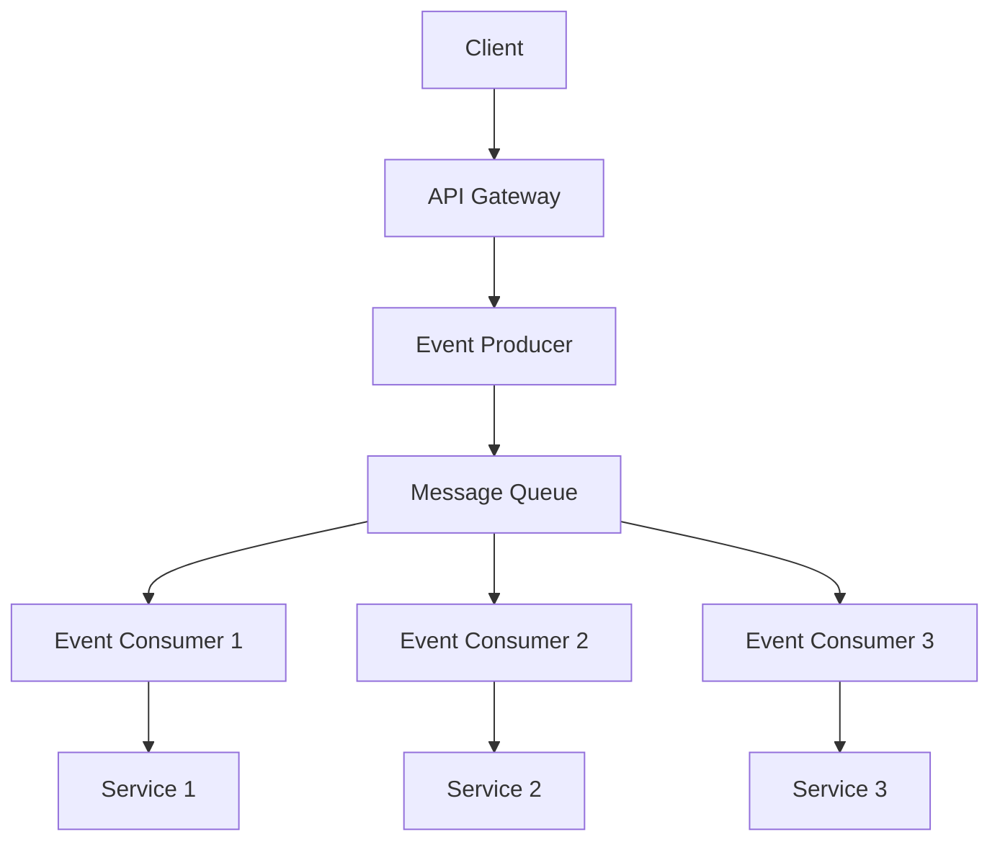

**Các component trong Event-Driven Architecture:**
1. **Event Producer**
   - Generate events
   - Event validation
   - Event formatting
   - Event routing
   - Error handling

2. **Message Queue**
   - Event storage
   - Event delivery
   - Message persistence
   - Message ordering
   - Dead letter queue

3. **Event Consumer**
   - Event processing
   - Event handling
   - Error recovery
   - Retry logic
   - Event acknowledgment

**CQRS (Command Query Responsibility Segregation)**
- **Định nghĩa:** Tách biệt operations thành commands (write) và queries (read).
- **Ưu điểm:** Tối ưu performance, dễ scale read/write riêng.
- **Nhược điểm:** Phức tạp hơn, cần sync data.
- **Khi nào sử dụng?**
  - Khi read/write ratio không cân bằng
  - Khi cần scale read/write riêng
  - Khi cần tối ưu performance

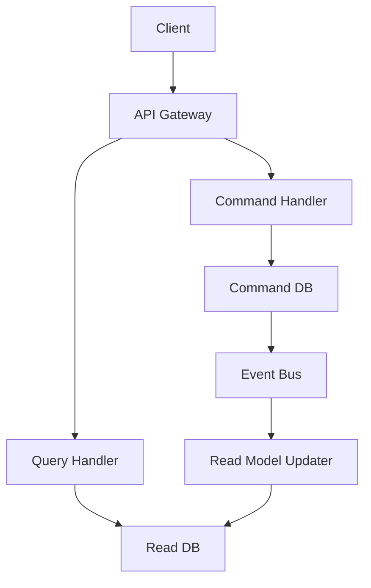

**Các component trong CQRS:**
1. **Command Handler**
   - Process write operations
   - Validate commands
   - Update write model
   - Generate events
   - Handle errors

2. **Query Handler**
   - Process read operations
   - Optimize queries
   - Cache results
   - Handle read model
   - Data aggregation

3. **Event Bus**
   - Event publishing
   - Event subscription
   - Event routing
   - Event persistence
   - Event replay

4. **Read Model Updater**
   - Update read model
   - Data synchronization
   - Cache invalidation
   - Data transformation
   - Consistency maintenance

---

### 3. Khả năng mở rộng & hiệu suất

**Horizontal vs Vertical Scaling**
- **Horizontal:** Thêm nhiều máy chủ
- **Vertical:** Tăng tài nguyên cho máy chủ hiện tại
- **Khi nào sử dụng?**
  - Horizontal: Khi cần scale không giới hạn
  - Vertical: Khi ứng dụng không phân tán được

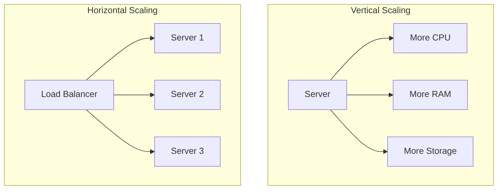

**Load Balancing**
- **Định nghĩa:** Phân phối tải giữa các máy chủ.
- **Chiến lược:**
  - Round Robin
  - Least Connections
  - IP Hash
  - Weighted Round Robin

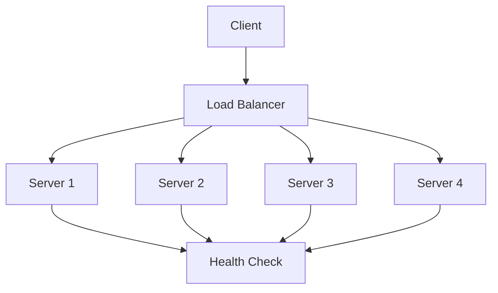

**Caching**
- **Định nghĩa:** Lưu trữ dữ liệu tạm thời để tăng tốc độ truy cập.
- **Loại cache:**
  - Application Cache
  - Database Cache
  - CDN Cache
  - Browser Cache

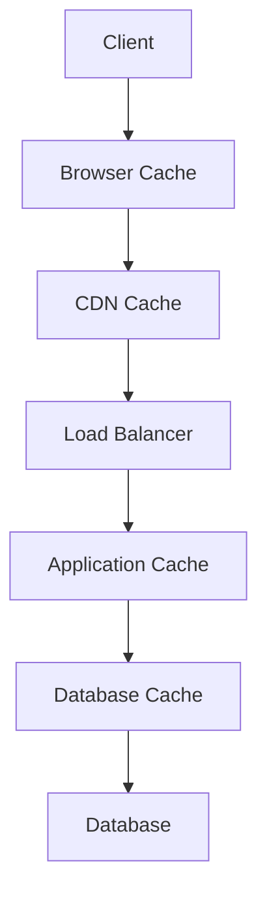

---

### 4. Phân tích & tối ưu bottleneck

**Xác định bottleneck**
- **Công cụ monitoring:**
  - APM tools
  - Log analysis
  - Performance metrics
  - User feedback

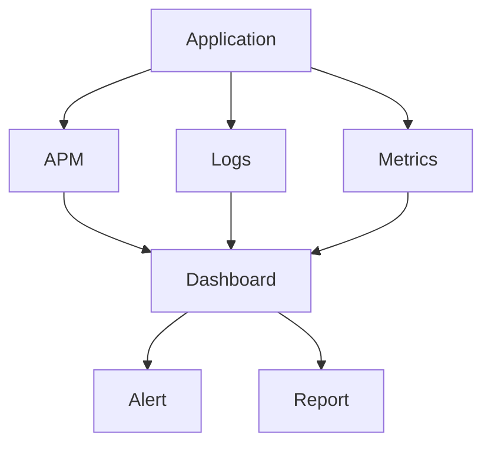

**Tối ưu database**
- Indexing
- Query optimization
- Connection pooling
- Caching

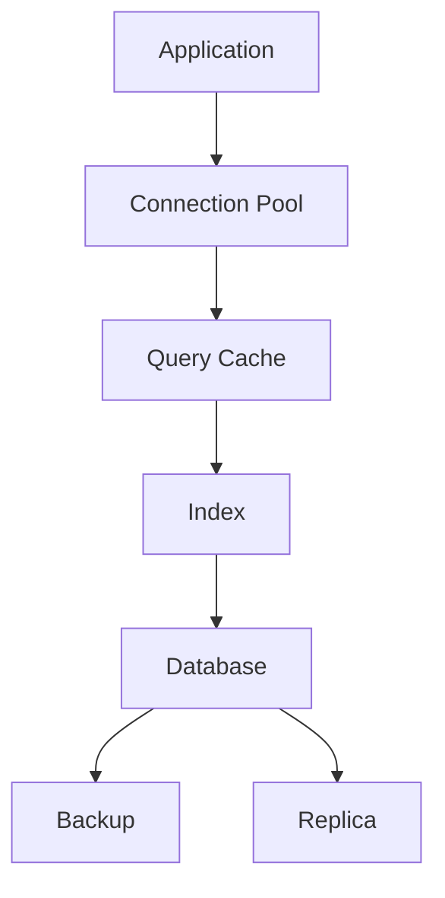

**Tối ưu application**
- Code profiling
- Memory management
- Concurrency
- Async processing

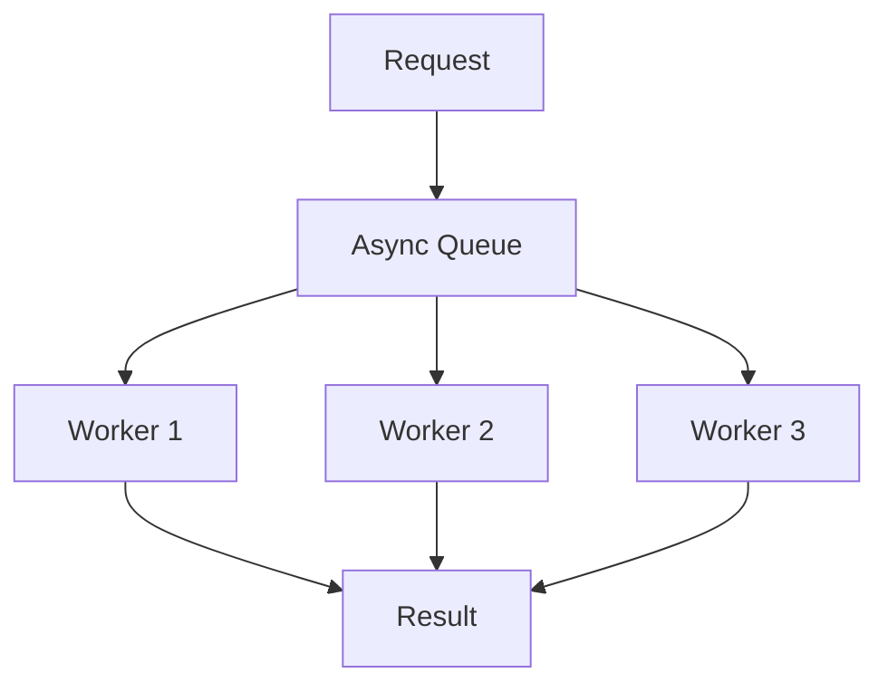

---

### 5. Case studies thực tế

**Twitter-like System**
- Requirements
- High-level design
- Database schema
- API endpoints
- Scaling strategy

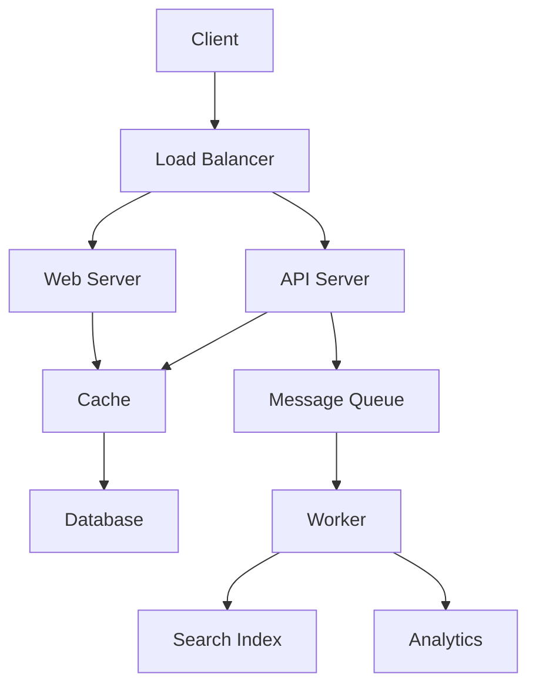

**Uber-like System**
- Real-time tracking
- Payment processing
- Location services
- Notification system

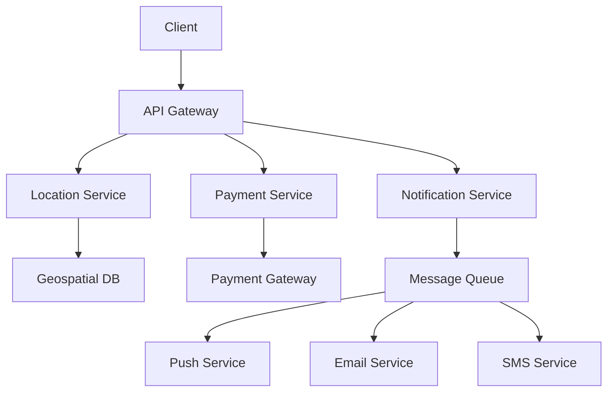

**Netflix-like System**
- Video streaming
- Content delivery
- Recommendation system
- User management

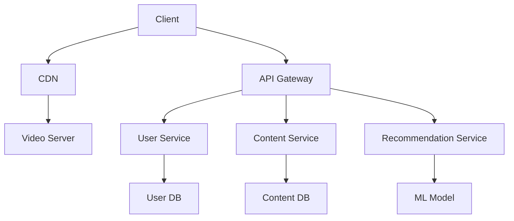

## Kết luận

Thiết kế hệ thống là một kỹ năng quan trọng cần được rèn luyện thường xuyên. Hãy thực hành với các case studies và luôn cân nhắc các yếu tố scalability, availability, và security trong thiết kế.

> "Good system design is about making the right trade-offs."

---

## Phụ lục nâng cao về System Design

### 1. Code ví dụ cho các service/pattern phổ biến

**Ví dụ: API Gateway (Python Flask)**
```python
from flask import Flask, request
app = Flask(__name__)

@app.route('/user/<user_id>')
def get_user(user_id):
    # Forward request to User Service
    return forward_to_service('user', user_id)

@app.route('/order/<order_id>')
def get_order(order_id):
    # Forward request to Order Service
    return forward_to_service('order', order_id)

# ... implement forward_to_service ...
```

**Ví dụ: Event Producer (Pseudocode)**
```python
def create_order(order_data):
    save_to_db(order_data)
    event = {'type': 'ORDER_CREATED', 'data': order_data}
    message_queue.publish(event)
```

**Ví dụ: Command Handler (CQRS, Pseudocode)**
```python
def handle_command(command):
    if command.type == 'CreateUser':
        user = create_user(command.data)
        event_bus.publish({'type': 'UserCreated', 'data': user})
```

---

### 2. Best Practices cho từng mẫu thiết kế

**Microservices**
- Định nghĩa rõ ràng ranh giới service
- Giao tiếp qua API chuẩn (REST/gRPC)
- Triển khai CI/CD tự động
- Theo dõi health check và logging riêng biệt
- Sử dụng service discovery

**Event-Driven**
- Đảm bảo idempotency cho consumer
- Sử dụng dead-letter queue cho lỗi
- Theo dõi event lag và latency
- Định nghĩa schema event rõ ràng

**CQRS**
- Tách biệt rõ read/write model
- Đảm bảo eventual consistency
- Sử dụng event sourcing nếu cần audit
- Tối ưu read model cho use case thực tế

---

### 3. Phân tích ưu/nhược điểm sâu hơn & ví dụ thực tế

| Pattern         | Ưu điểm nổi bật                | Nhược điểm lớn                | Ví dụ thực tế           |
|----------------|-------------------------------|------------------------------|------------------------|
| Monolith       | Đơn giản, dễ deploy           | Khó scale, dễ bottleneck      | Ứng dụng nhỏ, MVP      |
| Microservices  | Dễ scale, maintain, độc lập   | Phức tạp, cần DevOps mạnh     | Netflix, Amazon        |
| Event-Driven   | Real-time, loose coupling     | Debug khó, latency cao        | Uber, Slack            |
| CQRS           | Tối ưu read/write, audit tốt  | Phức tạp, cần sync dữ liệu    | Ngân hàng, e-commerce  |

---

### 4. Case Study chi tiết: Thiết kế hệ thống Twitter

**Yêu cầu:**
- Đăng bài, theo dõi user, news feed, scale lớn

**Thiết kế tổng thể:**
- API Gateway → Web Server → Service (User, Tweet, Feed, Notification)
- Database: User DB, Tweet DB, Feed Cache
- Message Queue cho async notification

**Mermaid:**
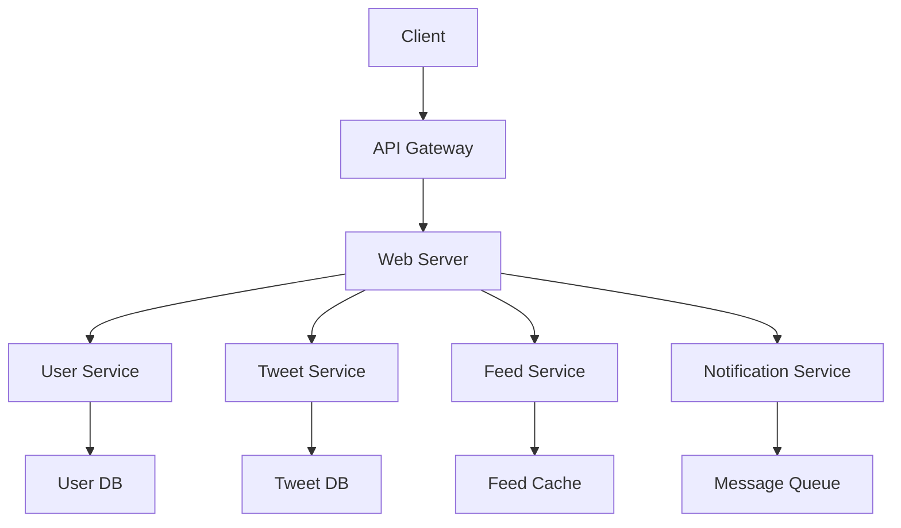

**Trade-off:**
- Feed precompute (tăng tốc đọc, tốn storage)
- Async notification (giảm latency, phức tạp hơn)
- Caching (tăng tốc, cần invalidation)

**Code ví dụ: Push Tweet vào Feed Cache**
```python
def post_tweet(user_id, tweet):
    save_tweet(user_id, tweet)
    followers = get_followers(user_id)
    for follower in followers:
        feed_cache.push(follower, tweet)
```

---

### 5. So sánh các mẫu thiết kế hệ thống

| Tiêu chí         | Monolith      | Microservices | Event-Driven | CQRS         |
|------------------|--------------|--------------|--------------|--------------|
| Đơn giản         | ++           | -            | -            | -            |
| Dễ scale         | -            | ++           | +            | +            |
| Dễ maintain      | -            | +            | +            | -            |
| Độc lập team      | -            | ++           | +            | +            |
| Phù hợp real-time | -            | +            | ++           | +            |
| Audit/log        | +            | +            | +            | ++           |

---

### 6. Checklist quy trình thiết kế hệ thống (phỏng vấn)

1. Hiểu rõ yêu cầu bài toán (functional & non-functional)
2. Ước lượng quy mô (users, QPS, data size)
3. Thiết kế high-level (component diagram, data flow)
4. Chọn kiến trúc phù hợp (Monolith/Microservices/Event-Driven...)
5. Thiết kế database (schema, index, cache)
6. Thiết kế API (REST/gRPC, endpoint, rate limit)
7. Đảm bảo scalability, availability, security
8. Phân tích bottleneck & giải pháp tối ưu
9. Đánh đổi (trade-off) và lý do chọn
10. Tổng kết, trả lời câu hỏi follow-up

---

### 7. Các lỗi thường gặp & anti-patterns

- Thiết kế quá phức tạp cho bài toán nhỏ
- Không tính đến scale/fault tolerance
- Không có monitoring/logging
- Không chuẩn hóa API
- Không tách biệt rõ các service
- Over-engineering (dùng microservices cho MVP)
- Không chuẩn bị cho data migration
- Không có backup/recovery plan

---

[Previous: Chapter 4 - Key Algorithm Topics](../04-algorithms/index.md) | [Next: Chapter 6 - Database Optimization](../06-database-optimization/index.md) 