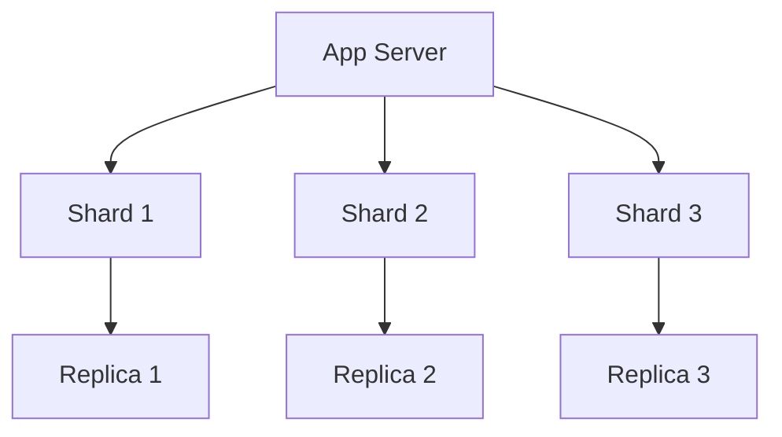
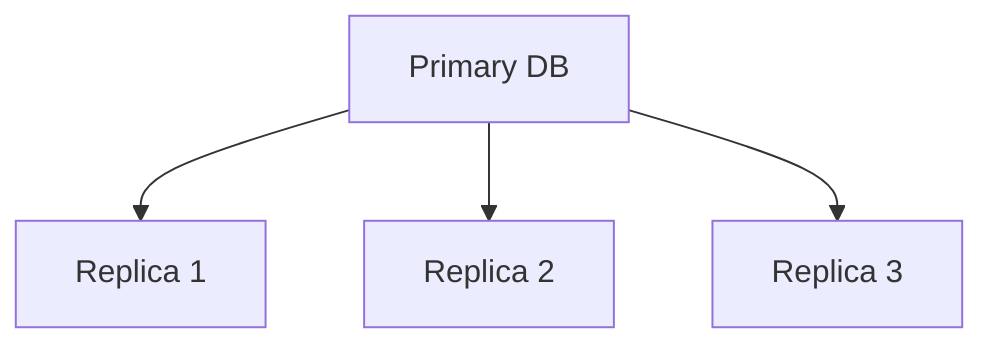
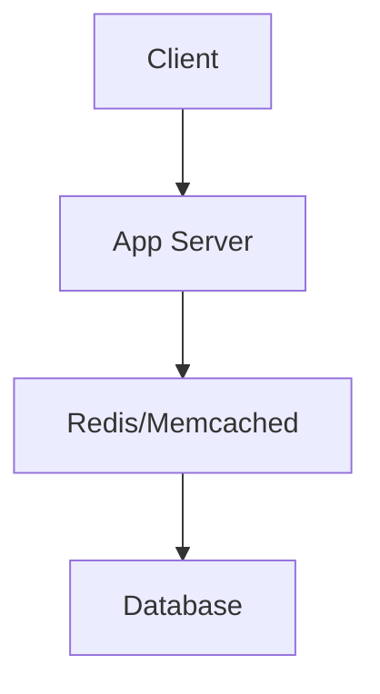

# Chapter 6: Database Optimization

[Tiếng Việt](index.md)

## Overview of Database Optimization

Database optimization is a crucial skill for building efficient and scalable applications. This chapter will help you understand and apply database optimization techniques.

---

### 1. Efficient Schema Design

**Normalization**
- **Definition:** The process of organizing data to reduce redundancy and dependency.
- **Pros:** Reduces data duplication, easier maintenance, high consistency.
- **Cons:** May impact performance due to many joins.
- **When to use?**
  - When data consistency is crucial
  - When data has many relationships
  - When reducing redundancy is needed

**Denormalization**
- **Definition:** Intentionally adding redundancy to optimize performance.
- **Pros:** Faster reads, fewer joins.
- **Cons:** Increased storage, harder maintenance.
- **When to use?**
  - When optimizing read performance
  - When dealing with complex queries
  - When reads significantly outnumber writes

**Data Types**
- **Definition:** Choosing appropriate data types for each column.
- **Pros:** Optimizes storage, improves performance.
- **Cons:** Requires good data understanding.
- **When to use?**
  - When designing new schema
  - When optimizing existing schema
  - When reducing storage is needed

---

### 2. Indexing & Query Optimization

**Indexing**
- **Definition:** Data structure to speed up data retrieval.
- **Types of indexes:**
  - Primary Key
  - Secondary Index
  - Composite Index
  - Partial Index
  - Expression Index

**Query Optimization**
- **Techniques:**
  - Using EXPLAIN
  - Optimizing WHERE clause
  - Avoiding SELECT *
  - Using LIMIT
  - Optimizing JOINs

**Common Pitfalls**
- **Avoid:**
  - Too many indexes
  - Queries not using indexes
  - N+1 query problem
  - Full table scans
  - Unnecessary joins

---

### 3. Caching Strategies

**Application-level Caching**
- **Definition:** Caching at the application level.
- **Tools:**
  - Redis
  - Memcached
  - Local cache
- **Strategies:**
  - Cache-aside
  - Write-through
  - Write-behind

**Database Caching**
- **Definition:** Caching at the database level.
- **Types:**
  - Query cache
  - Buffer pool
  - Result cache
- **Optimization:**
  - Cache hit ratio
  - Cache size
  - Eviction policy

**Distributed Caching**
- **Definition:** Cache distributed across multiple servers.
- **Pros:**
  - High availability
  - Scalability
  - Fault tolerance
- **Cons:**
  - Consistency
  - Network latency
  - Complexity

---

### 4. Scaling Databases

**Vertical Scaling**
- **Definition:** Increasing resources of existing server.
- **Pros:** Simple, no code changes needed.
- **Cons:** Limited, expensive.
- **When to use?**
  - When load increases moderately
  - When distribution isn't needed
  - When budget allows

**Horizontal Scaling**
- **Definition:** Adding more database servers.
- **Techniques:**
  - Sharding
  - Replication
  - Partitioning
- **Pros:**
  - Unlimited
  - Lower cost
  - High availability

**Sharding Strategies**
- **Types:**
  - Range-based
  - Hash-based
  - Directory-based
- **Pros:**
  - Increased throughput
  - Reduced latency
  - Easy to scale
- **Cons:**
  - Complex
  - Hard to maintain
  - Difficult joins

---

### 5. Best Practices & Anti-patterns

**Best Practices**
- **Design:**
  - Choose correct data types
  - Reasonable indexing
  - Normalize when needed
  - Denormalize when needed
  - Monitor performance

**Anti-patterns**
- **Avoid:**
  - Over-normalization
  - Under-normalization
  - Too many indexes
  - No indexes
  - Bad data types

**Monitoring & Maintenance**
- **Tools:**
  - Query analyzer
  - Performance monitor
  - Log analyzer
- **Tasks:**
  - Regular maintenance
  - Index rebuild
  - Statistics update
  - Backup & recovery

## Conclusion

Database optimization is a continuous process that requires regular monitoring and adjustment. Apply best practices and avoid anti-patterns for an efficient database system.

> "Database optimization is a balance between performance, maintainability, and scalability."

---

## Advanced Appendix: Database Optimization

### 1. Practical Code Examples

**Create Index (MySQL):**
```sql
CREATE INDEX idx_user_email ON users(email);
```

**Optimized Query (SQL):**
```sql
SELECT id, name FROM users WHERE email = 'abc@example.com' LIMIT 1;
```

**Using Redis Cache (Python):**
```python
import redis
r = redis.Redis(host='localhost', port=6379, db=0)
# Set cache
r.set('user:123', user_json, ex=3600)
# Get cache
user = r.get('user:123')
```

**Sharding (Pseudocode):**
```python
def get_shard(user_id, num_shards):
    return user_id % num_shards
# Example: user_id=15, num_shards=4 => shard 3
```

**Replication (MongoDB Shell):**
```js
rs.initiate()
rs.add('mongodb2.example.net')
rs.add('mongodb3.example.net')
```

---

### 2. Mermaid Diagrams for Architecture

**Sharding:**


**Replication:**


**Cache Layer:**


---

### 3. Database Optimization Checklist

1. Design schema properly, choose correct data types
2. Index frequently queried fields
3. Avoid SELECT *; only fetch needed columns
4. Use cache for hot data
5. Analyze queries with EXPLAIN
6. Monitor performance, log slow queries
7. Consider sharding/replication for large scale
8. Regularly backup and test recovery

---

### 4. Best Practices & Anti-patterns

**Best Practices:**
- Use indexes wisely, avoid redundant indexes
- Optimize queries, avoid unnecessary complex joins
- Use cache for hot data
- Monitor and optimize regularly
- Design clear backup/recovery plans

**Anti-patterns:**
- Over-indexing (too many indexes)
- Not indexing main query fields
- Using SELECT * everywhere
- Not checking for slow queries
- No backup plan

---

[Previous: Chapter 5 - System Design](../05-system-design/en.md) | [Next: Chapter 7 - Algorithm Analysis](../07-algorithm-analysis/en.md) 