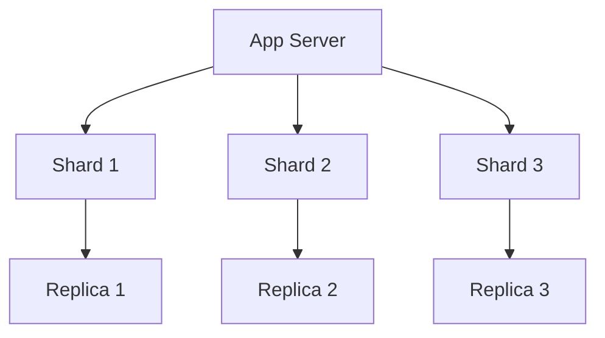
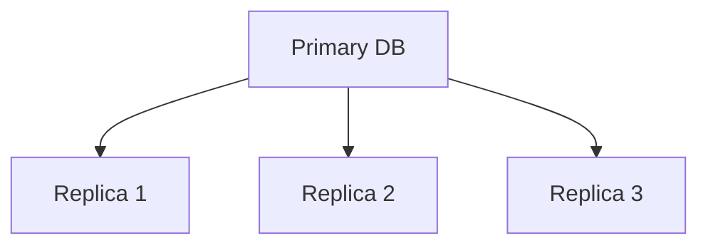
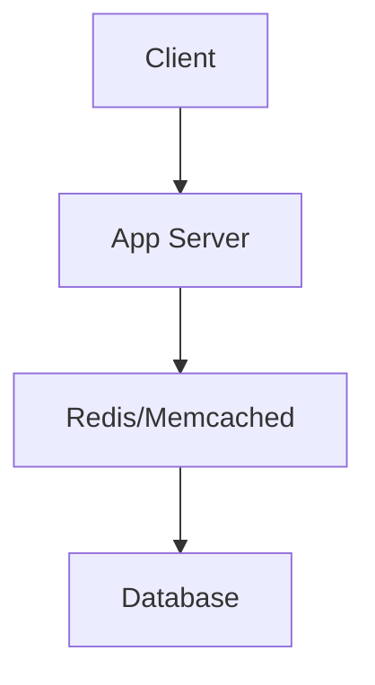

# Chương 6: Tối ưu cơ sở dữ liệu

[English Version](en.md)

## Tổng quan về tối ưu cơ sở dữ liệu

Tối ưu cơ sở dữ liệu là một kỹ năng quan trọng để xây dựng các ứng dụng hiệu quả và có khả năng mở rộng. Chương này sẽ giúp bạn hiểu và áp dụng các kỹ thuật tối ưu database.

---

### 1. Thiết kế schema hiệu quả

**Normalization**
- **Định nghĩa:** Quá trình tổ chức dữ liệu để giảm redundancy và dependency.
- **Ưu điểm:** Giảm dữ liệu trùng lặp, dễ maintain, tính nhất quán cao.
- **Nhược điểm:** Có thể ảnh hưởng performance do nhiều join.
- **Khi nào sử dụng?**
  - Khi cần tính nhất quán dữ liệu
  - Khi dữ liệu có nhiều relationship
  - Khi cần giảm redundancy

**Denormalization**
- **Định nghĩa:** Cố ý thêm redundancy để tối ưu performance.
- **Ưu điểm:** Tăng tốc độ đọc, giảm số lượng join.
- **Nhược điểm:** Tăng dung lượng lưu trữ, khó maintain.
- **Khi nào sử dụng?**
  - Khi cần tối ưu performance đọc
  - Khi có nhiều query phức tạp
  - Khi write ít hơn read nhiều

**Data Types**
- **Định nghĩa:** Chọn kiểu dữ liệu phù hợp cho từng cột.
- **Ưu điểm:** Tối ưu storage, tăng performance.
- **Nhược điểm:** Cần hiểu rõ về data.
- **Khi nào sử dụng?**
  - Khi thiết kế schema mới
  - Khi tối ưu schema hiện tại
  - Khi cần giảm storage

---

### 2. Indexing & Query Optimization

**Indexing**
- **Định nghĩa:** Cấu trúc dữ liệu để tăng tốc độ tìm kiếm.
- **Loại index:**
  - Primary Key
  - Secondary Index
  - Composite Index
  - Partial Index
  - Expression Index

**Query Optimization**
- **Kỹ thuật:**
  - Sử dụng EXPLAIN
  - Tối ưu WHERE clause
  - Tránh SELECT *
  - Sử dụng LIMIT
  - Tối ưu JOIN

**Common Pitfalls**
- **Tránh:**
  - Index quá nhiều
  - Query không sử dụng index
  - N+1 query problem
  - Full table scan
  - Unnecessary joins

---

### 3. Caching Strategies

**Application-level Caching**
- **Định nghĩa:** Cache ở tầng application.
- **Công cụ:**
  - Redis
  - Memcached
  - Local cache
- **Chiến lược:**
  - Cache-aside
  - Write-through
  - Write-behind

**Database Caching**
- **Định nghĩa:** Cache ở tầng database.
- **Loại:**
  - Query cache
  - Buffer pool
  - Result cache
- **Tối ưu:**
  - Cache hit ratio
  - Cache size
  - Eviction policy

**Distributed Caching**
- **Định nghĩa:** Cache phân tán trên nhiều server.
- **Ưu điểm:**
  - High availability
  - Scalability
  - Fault tolerance
- **Nhược điểm:**
  - Consistency
  - Network latency
  - Complexity

---

### 4. Scaling Databases

**Vertical Scaling**
- **Định nghĩa:** Tăng tài nguyên cho server hiện tại.
- **Ưu điểm:** Đơn giản, không cần thay đổi code.
- **Nhược điểm:** Giới hạn, chi phí cao.
- **Khi nào sử dụng?**
  - Khi tải tăng vừa phải
  - Khi không cần phân tán
  - Khi budget cho phép

**Horizontal Scaling**
- **Định nghĩa:** Thêm nhiều server database.
- **Kỹ thuật:**
  - Sharding
  - Replication
  - Partitioning
- **Ưu điểm:**
  - Không giới hạn
  - Chi phí thấp hơn
  - High availability

**Sharding Strategies**
- **Loại:**
  - Range-based
  - Hash-based
  - Directory-based
- **Ưu điểm:**
  - Tăng throughput
  - Giảm latency
  - Dễ scale
- **Nhược điểm:**
  - Phức tạp
  - Khó maintain
  - Join khó khăn

---

### 5. Best Practices & Anti-patterns

**Best Practices**
- **Thiết kế:**
  - Chọn đúng data type
  - Index hợp lý
  - Normalize khi cần
  - Denormalize khi cần
  - Monitor performance

**Anti-patterns**
- **Tránh:**
  - Over-normalization
  - Under-normalization
  - Too many indexes
  - No indexes
  - Bad data types

**Monitoring & Maintenance**
- **Công cụ:**
  - Query analyzer
  - Performance monitor
  - Log analyzer
- **Công việc:**
  - Regular maintenance
  - Index rebuild
  - Statistics update
  - Backup & recovery

## Kết luận

Tối ưu database là một quá trình liên tục, cần được theo dõi và điều chỉnh thường xuyên. Hãy áp dụng các best practices và tránh các anti-patterns để có một hệ thống database hiệu quả.

> "Database optimization is a balance between performance, maintainability, and scalability."

---

## Phụ lục nâng cao về Tối ưu cơ sở dữ liệu

### 1. Code mẫu thực tiễn

**Tạo Index (MySQL):**
```sql
CREATE INDEX idx_user_email ON users(email);
```

**Tối ưu Query (SQL):**
```sql
SELECT id, name FROM users WHERE email = 'abc@example.com' LIMIT 1;
```

**Sử dụng Redis Cache (Python):**
```python
import redis
r = redis.Redis(host='localhost', port=6379, db=0)
# Set cache
r.set('user:123', user_json, ex=3600)
# Get cache
user = r.get('user:123')
```

**Sharding (Pseudocode):**
```python
def get_shard(user_id, num_shards):
    return user_id % num_shards
# Ví dụ: user_id=15, num_shards=4 => shard 3
```

**Replication (MongoDB Shell):**
```js
rs.initiate()
rs.add('mongodb2.example.net')
rs.add('mongodb3.example.net')
```

---

### 2. Biểu đồ Mermaid minh họa kiến trúc

**Sharding:**


**Replication:**


**Cache Layer:**


---

### 3. Checklist tối ưu cơ sở dữ liệu

1. Thiết kế schema hợp lý, chọn đúng data type
2. Index các trường truy vấn nhiều
3. Tránh SELECT *; chỉ lấy trường cần thiết
4. Sử dụng cache cho dữ liệu truy cập nhiều
5. Phân tích query với EXPLAIN
6. Theo dõi performance, log slow query
7. Cân nhắc sharding/replication khi scale lớn
8. Định kỳ backup và kiểm tra phục hồi

---

### 4. Best Practices & Anti-patterns

**Best Practices:**
- Sử dụng index hợp lý, tránh index dư thừa
- Tối ưu query, tránh join phức tạp không cần thiết
- Sử dụng cache cho dữ liệu hot
- Theo dõi và tối ưu định kỳ
- Thiết kế backup/recovery rõ ràng

**Anti-patterns:**
- Over-indexing (quá nhiều index)
- Không dùng index cho trường truy vấn chính
- SELECT * mọi nơi
- Không kiểm tra slow query
- Không có kế hoạch backup

---

[Previous: Chapter 5 - System Design](../05-system-design/index.md) | [Next: Chapter 7 - Algorithm Analysis](../07-algorithm-analysis/index.md) 