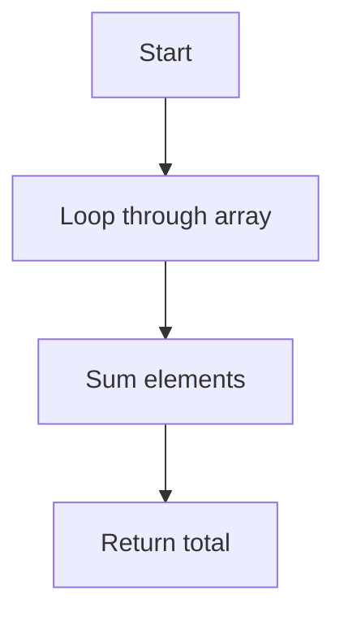

# Chapter 7: Algorithm Analysis

[Tiếng Việt](index.md)

---

## 1. Time & Space Complexity

**Definition:**
- Time Complexity: Measures the number of operations as input size increases.
- Space Complexity: Measures the amount of memory used by the algorithm.

**Example:**
```python
# Sum of array - O(n) time, O(1) space
arr = [1,2,3,4,5]
total = 0
for x in arr:
    total += x
print(total)
```

**Mermaid:**


---

## 2. Big O, Big Theta, Big Omega

- **Big O (O):** Upper bound (worst-case)
- **Big Theta (Θ):** Tight bound (average-case)
- **Big Omega (Ω):** Lower bound (best-case)

**Examples:**
- Linear search: O(n), Θ(n), Ω(1) (if target is at the start)
- Binary search: O(log n), Θ(log n), Ω(1) (if target is in the middle)

---

## 3. Real-world Example Analysis

### Case 1: Compare Two Sorting Algorithms

**Bubble Sort:**
```python
def bubble_sort(arr):
    n = len(arr)
    for i in range(n):
        for j in range(0, n-i-1):
            if arr[j] > arr[j+1]:
                arr[j], arr[j+1] = arr[j+1], arr[j]
    return arr
# O(n^2) time
```

**Merge Sort:**
```python
def merge_sort(arr):
    if len(arr) <= 1:
        return arr
    mid = len(arr)//2
    left = merge_sort(arr[:mid])
    right = merge_sort(arr[mid:])
    res = []
    i = j = 0
    while i < len(left) and j < len(right):
        if left[i] < right[j]:
            res.append(left[i])
            i += 1
        else:
            res.append(right[j])
            j += 1
    res.extend(left[i:])
    res.extend(right[j:])
    return res
# O(n log n) time
```

**Comparison:**
| Algorithm    | Avg. Time Complexity | Space |
|--------------|---------------------|-------|
| Bubble Sort  | O(n^2)              | O(1)  |
| Merge Sort   | O(n log n)          | O(n)  |

---

### Case 2: Binary Search Analysis

```python
def binary_search(arr, target):
    l, r = 0, len(arr)-1
    while l <= r:
        mid = (l + r) // 2
        if arr[mid] == target:
            return mid
        elif arr[mid] < target:
            l = mid + 1
        else:
            r = mid - 1
    return -1
# O(log n) time, O(1) space
```

**Mermaid:**
```mermaid
graph TD
    A[Start] --> B{l <= r?}
    B -- No --> C[Return -1]
    B -- Yes --> D[Calculate mid]
    D --> E{arr[mid] == target?}
    E -- Yes --> F[Return mid]
    E -- No --> G{arr[mid] < target?}
    G -- Yes --> H[l = mid+1]
    G -- No --> I[r = mid-1]
    H --> B
    I --> B
```

---

### Case 3: Dynamic Programming (Fibonacci)

```python
def fib(n):
    if n <= 1: return n
    dp = [0, 1]
    for i in range(2, n+1):
        dp.append(dp[-1] + dp[-2])
    return dp[n]
# O(n) time, O(n) space
```

---

## 4. Solution Comparison & Optimization

- Always compare solutions by time, space, and implementation simplicity.
- Prefer optimal solutions for large data.

**Example:**
- Use a hash set to check for duplicates in O(1) instead of O(n) with nested loops.

```python
# Check for duplicates
arr = [1,2,3,2,4]
seen = set()
for x in arr:
    if x in seen:
        print('Duplicate:', x)
    seen.add(x)
# O(n) time, O(n) space
```

---

## 5. Common Pitfalls

- Only considering worst-case, ignoring best/average-case
- Not accounting for extra memory
- Misjudging nested loops
- Not testing with large inputs
- Not optimizing for special cases

---

[Previous: Chapter 6 - Database Optimization](../06-database-optimization/en.md) | [Next: Chapter 8 - LeetCode Problem Walkthroughs](../08-leetcode-solutions/en.md) 