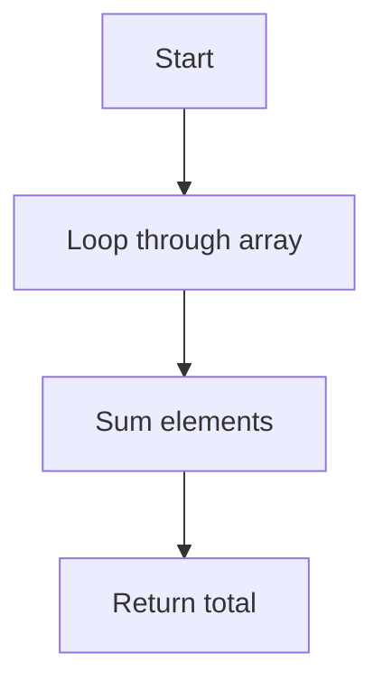

# Chương 7: Đánh giá thuật toán

[English Version](en.md)

---

## 1. Độ phức tạp thời gian và không gian (Time & Space Complexity)

**Định nghĩa:**
- Độ phức tạp thời gian (Time Complexity): Đo lường số phép toán khi kích thước đầu vào tăng.
- Độ phức tạp không gian (Space Complexity): Đo lường lượng bộ nhớ sử dụng khi chạy thuật toán.

**Ví dụ:**
```python
# Tính tổng mảng - O(n) thời gian, O(1) bộ nhớ
arr = [1,2,3,4,5]
total = 0
for x in arr:
    total += x
print(total)
```

**Mermaid:**


---

## 2. Big O, Big Theta, Big Omega

- **Big O (O):** Giới hạn trên (worst-case)
- **Big Theta (Θ):** Giới hạn chặt (tight bound)
- **Big Omega (Ω):** Giới hạn dưới (best-case)

**Ví dụ:**
- Tìm kiếm tuyến tính: O(n), Θ(n), Ω(1) (nếu phần tử ở đầu)
- Tìm kiếm nhị phân: O(log n), Θ(log n), Ω(1) (nếu phần tử ở giữa)

---

## 3. Phân tích ví dụ thực tế

### Case 1: So sánh hai thuật toán sắp xếp

**Bubble Sort:**
```python
def bubble_sort(arr):
    n = len(arr)
    for i in range(n):
        for j in range(0, n-i-1):
            if arr[j] > arr[j+1]:
                arr[j], arr[j+1] = arr[j+1], arr[j]
    return arr
# O(n^2) thời gian
```

**Merge Sort:**
```python
def merge_sort(arr):
    if len(arr) <= 1:
        return arr
    mid = len(arr)//2
    left = merge_sort(arr[:mid])
    right = merge_sort(arr[mid:])
    res = []
    i = j = 0
    while i < len(left) and j < len(right):
        if left[i] < right[j]:
            res.append(left[i])
            i += 1
        else:
            res.append(right[j])
            j += 1
    res.extend(left[i:])
    res.extend(right[j:])
    return res
# O(n log n) thời gian
```

**So sánh:**
| Thuật toán    | Thời gian trung bình | Bộ nhớ |
|---------------|---------------------|--------|
| Bubble Sort   | O(n^2)              | O(1)   |
| Merge Sort    | O(n log n)          | O(n)   |

---

### Case 2: Phân tích thuật toán tìm kiếm nhị phân

```python
def binary_search(arr, target):
    l, r = 0, len(arr)-1
    while l <= r:
        mid = (l + r) // 2
        if arr[mid] == target:
            return mid
        elif arr[mid] < target:
            l = mid + 1
        else:
            r = mid - 1
    return -1
# O(log n) thời gian, O(1) bộ nhớ
```

**Mermaid:**
```mermaid
graph TD
    A[Start] --> B{l <= r?}
    B -- No --> C[Return -1]
    B -- Yes --> D[Calculate mid]
    D --> E{arr[mid] == target?}
    E -- Yes --> F[Return mid]
    E -- No --> G{arr[mid] < target?}
    G -- Yes --> H[l = mid+1]
    G -- No --> I[r = mid-1]
    H --> B
    I --> B
```

---

### Case 3: Phân tích thuật toán quy hoạch động (Fibonacci)

```python
def fib(n):
    if n <= 1: return n
    dp = [0, 1]
    for i in range(2, n+1):
        dp.append(dp[-1] + dp[-2])
    return dp[n]
# O(n) thời gian, O(n) bộ nhớ
```

---

## 4. So sánh & tối ưu giải pháp

- Luôn so sánh các giải pháp về thời gian, bộ nhớ, độ dễ cài đặt.
- Ưu tiên giải pháp tối ưu cho dữ liệu lớn.

**Ví dụ:**
- Sử dụng hash set để kiểm tra phần tử trùng O(1) thay vì O(n) với vòng lặp lồng nhau.

```python
# Kiểm tra phần tử trùng
arr = [1,2,3,2,4]
seen = set()
for x in arr:
    if x in seen:
        print('Duplicate:', x)
    seen.add(x)
# O(n) thời gian, O(n) bộ nhớ
```

---

## 5. Lỗi thường gặp khi phân tích

- Chỉ xét worst-case, bỏ qua best/average-case
- Không tính đến bộ nhớ phụ
- Đánh giá sai vòng lặp lồng nhau
- Không kiểm tra input lớn
- Không tối ưu cho trường hợp đặc biệt

---

[Previous: Chương 6 - Tối ưu cơ sở dữ liệu](../06-database-optimization/index.md) | [Next: Chương 8 - Phân tích & giải mẫu LeetCode](../08-leetcode-solutions/index.md) 