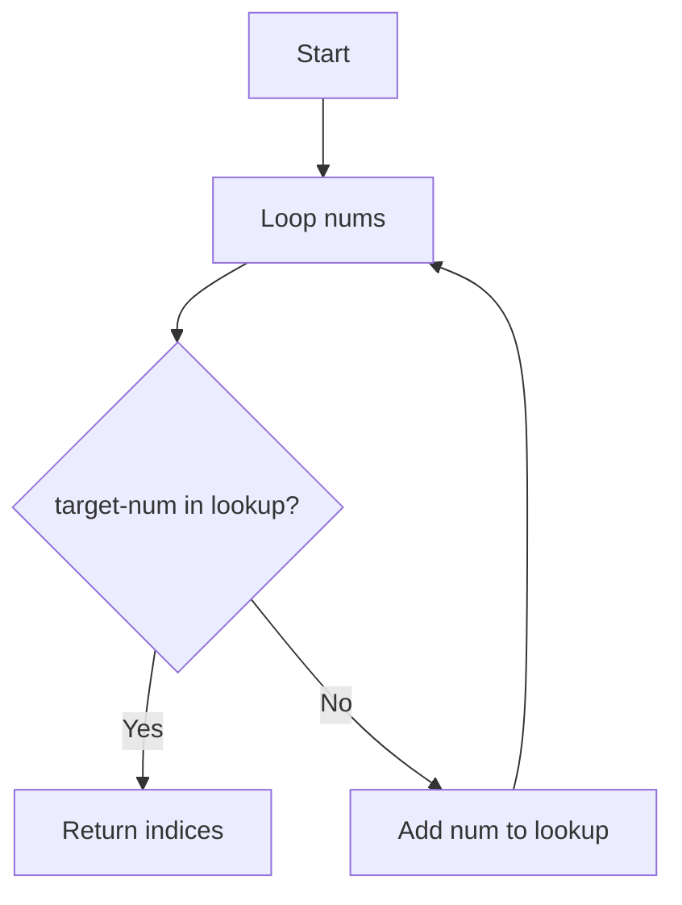
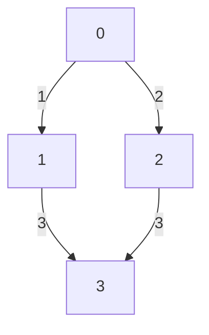

# Chapter 8: LeetCode Problem Walkthroughs

[Tiếng Việt](index.md)

---

## 1. Two Sum (Array & Hash Table)

**Problem:**
- Given an array nums and a target, find two indices i, j such that nums[i] + nums[j] = target.

**Analysis:**
- Brute force is O(n^2) with two loops, but a hash table can optimize to O(n).

**Approach:**
- Iterate through the array, for each element check if (target - nums[i]) is already in the hash table.

**Code Example:**
```python
def two_sum(nums, target):
    lookup = {}
    for i, num in enumerate(nums):
        if target - num in lookup:
            return [lookup[target - num], i]
        lookup[num] = i
print(two_sum([2,7,11,15], 9))  # [0,1]
```

**Mermaid:**


---

## 2. Binary Search

**Problem:**
- Find the index of target in a sorted array.

**Analysis:**
- Use binary search for O(log n) time.

**Code Example:**
```python
def binary_search(arr, target):
    l, r = 0, len(arr)-1
    while l <= r:
        mid = (l + r) // 2
        if arr[mid] == target:
            return mid
        elif arr[mid] < target:
            l = mid + 1
        else:
            r = mid - 1
    return -1
print(binary_search([1,3,5,7,9], 5))  # 2
```

---

## 3. BFS/DFS (Graph/Tree)

**Problem:**
- Find the shortest path in an unweighted graph.

**Analysis:**
- Use BFS for shortest path, DFS for full traversal.

**BFS Code Example:**
```python
from collections import deque
def bfs(graph, start):
    visited = set([start])
    q = deque([start])
    while q:
        node = q.popleft()
        print(node)
        for neighbor in graph[node]:
            if neighbor not in visited:
                visited.add(neighbor)
                q.append(neighbor)
graph = {0:[1,2], 1:[0,3], 2:[0,3], 3:[1,2]}
bfs(graph, 0)
```

**Mermaid:**


---

## 4. Dynamic Programming (Fibonacci)

**Problem:**
- Compute the nth Fibonacci number.

**Analysis:**
- Use a dp array to store intermediate results and avoid recomputation.

**Code Example:**
```python
def fib(n):
    if n <= 1: return n
    dp = [0, 1]
    for i in range(2, n+1):
        dp.append(dp[-1] + dp[-2])
    return dp[n]
print(fib(10))  # 55
```

---

## 5. Backtracking (Permutations)

**Problem:**
- Generate all permutations of an array.

**Analysis:**
- Use recursion and a used array to generate all permutations.

**Code Example:**
```python
def permute(nums):
    res = []
    def backtrack(path, used):
        if len(path) == len(nums):
            res.append(path[:])
            return
        for i in range(len(nums)):
            if used[i]: continue
            used[i] = True
            path.append(nums[i])
            backtrack(path, used)
            path.pop()
            used[i] = False
    backtrack([], [False]*len(nums))
    return res
print(permute([1,2,3]))
```

---

[Previous: Chapter 7 - Algorithm Analysis](../07-algorithm-analysis/en.md) | [Next: Chapter 9 - Problem Solving Skills](../09-problem-solving/en.md) 