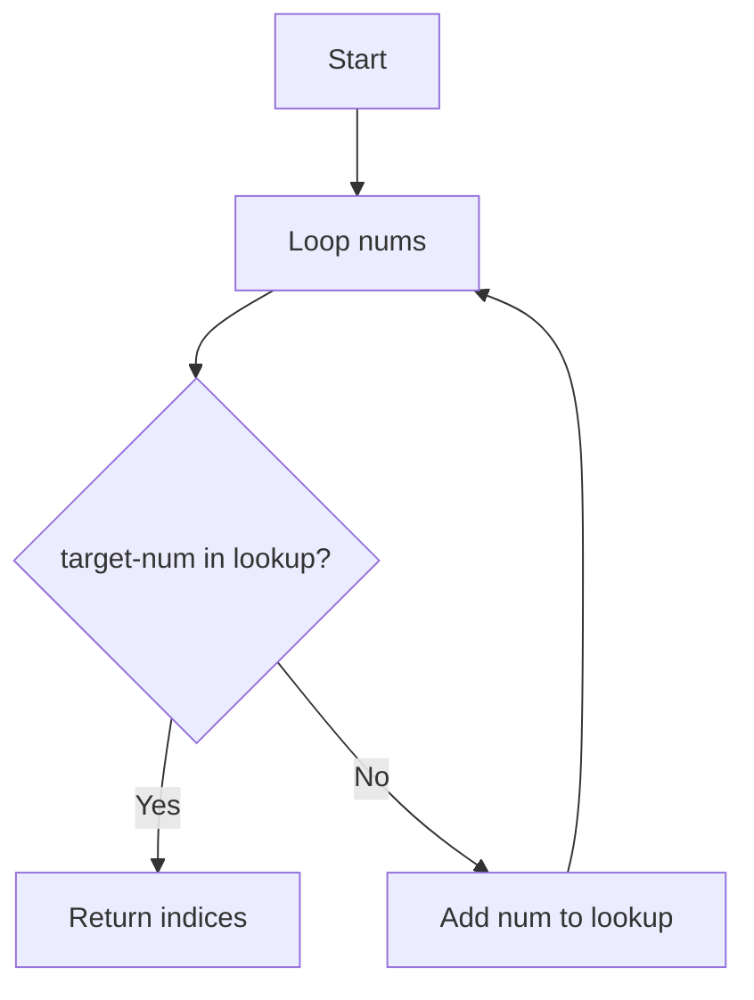
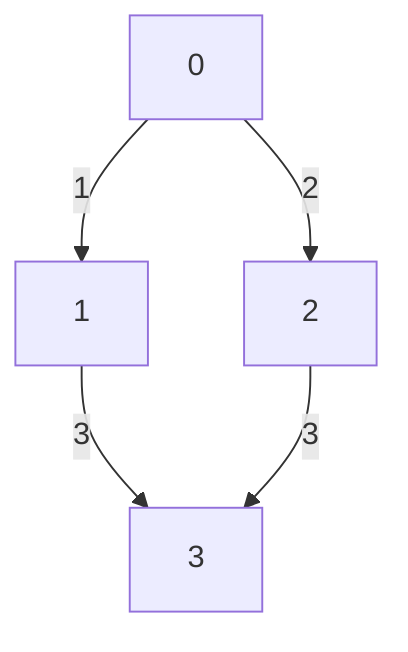

# Chương 8: Phân tích & giải mẫu bài LeetCode

[English Version](en.md)

---

## 1. Two Sum (Mảng & Hash Table)

**Đề bài:**
- Cho mảng nums và số target, tìm hai chỉ số i, j sao cho nums[i] + nums[j] = target.

**Phân tích:**
- Có thể dùng hai vòng lặp (O(n^2)), nhưng dùng hash table sẽ tối ưu hơn.

**Hướng tiếp cận:**
- Duyệt từng phần tử, kiểm tra (target - nums[i]) đã xuất hiện chưa bằng hash table.

**Code mẫu:**
```python
def two_sum(nums, target):
    lookup = {}
    for i, num in enumerate(nums):
        if target - num in lookup:
            return [lookup[target - num], i]
        lookup[num] = i
print(two_sum([2,7,11,15], 9))  # [0,1]
```

**Mermaid:**


---

## 2. Binary Search (Tìm kiếm nhị phân)

**Đề bài:**
- Tìm vị trí của target trong mảng đã sắp xếp.

**Phân tích:**
- Áp dụng binary search để đạt O(log n).

**Code mẫu:**
```python
def binary_search(arr, target):
    l, r = 0, len(arr)-1
    while l <= r:
        mid = (l + r) // 2
        if arr[mid] == target:
            return mid
        elif arr[mid] < target:
            l = mid + 1
        else:
            r = mid - 1
    return -1
print(binary_search([1,3,5,7,9], 5))  # 2
```

---

## 3. BFS/DFS (Đồ thị, cây)

**Đề bài:**
- Tìm đường đi ngắn nhất trong đồ thị không trọng số.

**Phân tích:**
- BFS cho shortest path, DFS cho duyệt toàn bộ.

**Code mẫu BFS:**
```python
from collections import deque
def bfs(graph, start):
    visited = set([start])
    q = deque([start])
    while q:
        node = q.popleft()
        print(node)
        for neighbor in graph[node]:
            if neighbor not in visited:
                visited.add(neighbor)
                q.append(neighbor)
graph = {0:[1,2], 1:[0,3], 2:[0,3], 3:[1,2]}
bfs(graph, 0)
```

**Mermaid:**


---

## 4. Dynamic Programming (Fibonacci)

**Đề bài:**
- Tính số Fibonacci thứ n.

**Phân tích:**
- Dùng mảng dp để lưu kết quả trung gian, tránh tính lại.

**Code mẫu:**
```python
def fib(n):
    if n <= 1: return n
    dp = [0, 1]
    for i in range(2, n+1):
        dp.append(dp[-1] + dp[-2])
    return dp[n]
print(fib(10))  # 55
```

---

## 5. Backtracking (Sinh hoán vị)

**Đề bài:**
- Sinh tất cả các hoán vị của mảng.

**Phân tích:**
- Dùng đệ quy và mảng đánh dấu để sinh các hoán vị.

**Code mẫu:**
```python
def permute(nums):
    res = []
    def backtrack(path, used):
        if len(path) == len(nums):
            res.append(path[:])
            return
        for i in range(len(nums)):
            if used[i]: continue
            used[i] = True
            path.append(nums[i])
            backtrack(path, used)
            path.pop()
            used[i] = False
    backtrack([], [False]*len(nums))
    return res
print(permute([1,2,3]))
```

---

[Previous: Chương 7 - Đánh giá thuật toán](../07-algorithm-analysis/index.md) | [Next: Chương 9 - Kỹ năng giải quyết vấn đề](../09-problem-solving/index.md) 