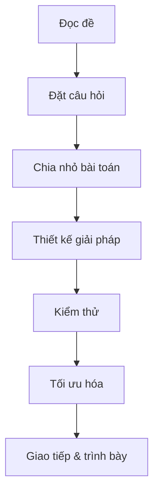

# Chương 9: Kỹ năng giải quyết vấn đề & tư duy phỏng vấn

[English Version](en.md)

---

## 1. Phân tích đề bài & đặt câu hỏi (Clarifying Questions)

**Ý nghĩa:**
- Hiểu rõ yêu cầu, xác định input/output, ràng buộc, trường hợp đặc biệt.

**Ví dụ thực tế:**
- "Input có thể rỗng không?"
- "Có số âm không?"
- "Dữ liệu có thể rất lớn không?"

**Checklist:**
- Đọc kỹ đề, gạch chân từ khóa
- Đặt câu hỏi về input, output, edge case
- Xác nhận lại với interviewer

---

## 2. Chia nhỏ bài toán (Decomposition)

**Ý nghĩa:**
- Tách bài toán lớn thành các phần nhỏ dễ xử lý hơn.

**Ví dụ:**
- Bài toán "Đảo ngược từng từ trong câu":
  1. Chia câu thành các từ
  2. Đảo ngược từng từ
  3. Ghép lại thành câu mới

**Code mẫu:**
```python
def reverse_words(s):
    return ' '.join(word[::-1] for word in s.split())
print(reverse_words('hello world'))  # 'olleh dlrow'
```

---

## 3. Thiết kế giải pháp từng bước (Stepwise Refinement)

**Ý nghĩa:**
- Xây dựng giải pháp từ đơn giản đến phức tạp, từng bước một.

**Ví dụ:**
- Bài toán kiểm tra số nguyên tố:
  1. Kiểm tra n < 2
  2. Duyệt từ 2 đến sqrt(n), kiểm tra chia hết

**Code mẫu:**
```python
def is_prime(n):
    if n < 2: return False
    for i in range(2, int(n**0.5)+1):
        if n % i == 0:
            return False
    return True
print(is_prime(17))  # True
```

---

## 4. Kiểm thử & kiểm tra biên (Testing & Edge Cases)

**Ý nghĩa:**
- Đảm bảo giải pháp đúng với mọi trường hợp, đặc biệt là input biên.

**Ví dụ:**
- Test với mảng rỗng, 1 phần tử, số âm, số lớn, chuỗi đặc biệt...

**Checklist:**
- Viết test case cho input nhỏ, lớn, đặc biệt
- Kiểm tra output với từng trường hợp

---

## 5. Tối ưu hóa giải pháp (Optimization)

**Ý nghĩa:**
- Cải thiện thời gian/bộ nhớ, chọn thuật toán/kỹ thuật phù hợp.

**Ví dụ:**
- Dùng hash set để kiểm tra trùng lặp thay vì 2 vòng lặp.

**Code mẫu:**
```python
arr = [1,2,3,2,4]
seen = set()
for x in arr:
    if x in seen:
        print('Duplicate:', x)
    seen.add(x)
```

---

## 6. Giao tiếp & trình bày ý tưởng (Communication)

**Ý nghĩa:**
- Trình bày rõ ràng suy nghĩ, giải thích từng bước, hỏi lại khi cần.

**Tips:**
- Nói to suy nghĩ khi code
- Vẽ sơ đồ/flowchart nếu cần
- Chủ động hỏi lại khi chưa rõ

**Mermaid:**


---

[Previous: Chương 8 - Phân tích & giải mẫu LeetCode](../08-leetcode-solutions/index.md) | [Next: Chương 10 - Kỹ năng mềm & chuẩn bị hồ sơ](../10-soft-skills/index.md) 