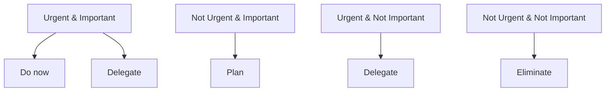

# Chapter 10: Soft Skills & Resume Preparation

[Tiếng Việt](index.md)

---

## 1. Communication & Teamwork

**Meaning:**
- Effective communication helps with teamwork, clear idea presentation, and conflict resolution.

**Real-world examples:**
- Proactively ask when requirements are unclear.
- Listen to teammates, give positive feedback.

**Tips:**
- Practice concise idea presentation.
- Take notes on key points during meetings.

---

## 2. Time Management & Prioritization

**Meaning:**
- Organize work efficiently, avoid missed deadlines, balance study/work.

**Example:**
- Use the Eisenhower Matrix to classify urgent/important tasks.

**Checklist:**
- Make a daily to-do list.
- Prioritize important tasks first.
- Set clear deadlines for each task.

**Mermaid:**


---

## 3. Impressive CV/Resume Preparation

**Meaning:**
- Your CV is the first impression for employers, should be concise and highlight achievements.

**Tips:**
- Use strong action verbs (achieved, led, improved...)
- Include specific numbers ("Increased performance by 30%...")
- Clear formatting, no typos

**Example:**
- "Optimized the system to reduce processing time from 5s to 2s."

---

## 4. Portfolio & LinkedIn

**Meaning:**
- Portfolio/LinkedIn showcases your projects, skills, and professional network.

**Checklist:**
- Update profile picture, professional headline
- Post personal projects, code, articles
- Connect with colleagues, industry experts

---

## 5. Cover Letter Writing

**Meaning:**
- A cover letter shows your motivation and fit for the position.

**Tips:**
- Personalize for each company
- State why you chose the company/position
- Give real examples of relevant skills

**Example:**
- "I am impressed by your product X and eager to contribute to your development team."

---

## 6. Behavioral Interview Skills

**Meaning:**
- Assess soft skills, problem solving, teamwork through situational questions.

**Sample questions:**
- "Tell me about a time you resolved a team conflict."
- "Describe a failure and what you learned."

**Tips:**
- Answer using the STAR method (Situation, Task, Action, Result)

**STAR Example:**
```text
Situation: Project was delayed due to lack of communication.
Task: Act as a bridge between team members.
Action: Proactively organized meetings, redistributed tasks.
Result: Project finished on time, team understood each other better.
```

---

## 7. Interview Preparation Checklist

- Research the company and position
- Prepare common questions (technical & behavioral)
- Print CV, portfolio
- Practice mock interviews
- Prepare outfit, arrive early

---

[Previous: Chapter 9 - Problem Solving Skills](../09-problem-solving/en.md) | [Next: Chapter 11 - Real Experiences & Insights](../11-real-experience/en.md) 