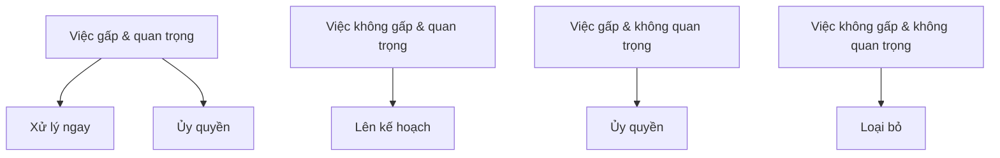

# Chương 10: Kỹ năng mềm & chuẩn bị hồ sơ

[English Version](en.md)

---

## 1. Kỹ năng giao tiếp & teamwork

**Ý nghĩa:**
- Giao tiếp hiệu quả giúp làm việc nhóm tốt, trình bày ý tưởng rõ ràng, giải quyết xung đột.

**Ví dụ thực tế:**
- Chủ động hỏi khi chưa rõ yêu cầu.
- Lắng nghe ý kiến đồng đội, phản hồi tích cực.

**Tips:**
- Luyện tập trình bày ý tưởng ngắn gọn.
- Ghi chú lại các điểm quan trọng khi họp nhóm.

---

## 2. Kỹ năng quản lý thời gian & ưu tiên

**Ý nghĩa:**
- Sắp xếp công việc hợp lý, tránh trễ deadline, cân bằng học tập/làm việc.

**Ví dụ:**
- Sử dụng ma trận Eisenhower để phân loại việc gấp/quan trọng.

**Checklist:**
- Lập to-do list mỗi ngày.
- Ưu tiên việc quan trọng trước.
- Đặt deadline rõ ràng cho từng task.

**Mermaid:**


---

## 3. Chuẩn bị CV/Resume ấn tượng

**Ý nghĩa:**
- CV là ấn tượng đầu tiên với nhà tuyển dụng, cần ngắn gọn, nổi bật thành tích.

**Tips:**
- Sử dụng động từ mạnh (achieved, led, improved...)
- Đưa số liệu cụ thể ("Tăng hiệu suất 30%...")
- Định dạng rõ ràng, không lỗi chính tả

**Ví dụ:**
- "Tối ưu hệ thống giúp giảm thời gian xử lý từ 5s xuống 2s."

---

## 4. Portfolio & LinkedIn cá nhân

**Ý nghĩa:**
- Portfolio/LinkedIn giúp thể hiện dự án, kỹ năng, network chuyên nghiệp.

**Checklist:**
- Cập nhật ảnh đại diện, headline chuyên nghiệp
- Đăng dự án cá nhân, mã nguồn, bài viết
- Kết nối với đồng nghiệp, chuyên gia ngành

---

## 5. Viết thư xin việc (Cover Letter)

**Ý nghĩa:**
- Thư xin việc giúp thể hiện động lực, phù hợp với vị trí ứng tuyển.

**Tips:**
- Cá nhân hóa cho từng công ty
- Nêu rõ lý do chọn công ty/vị trí
- Đưa ví dụ thực tế về kỹ năng phù hợp

**Ví dụ:**
- "Tôi rất ấn tượng với sản phẩm X của công ty và mong muốn đóng góp vào đội ngũ phát triển."

---

## 6. Kỹ năng phỏng vấn hành vi (Behavioral Interview)

**Ý nghĩa:**
- Đánh giá kỹ năng mềm, giải quyết vấn đề, teamwork qua các câu hỏi tình huống.

**Ví dụ câu hỏi:**
- "Kể về lần bạn giải quyết xung đột trong nhóm."
- "Bạn đã từng thất bại và học được gì?"

**Tips:**
- Trả lời theo mô hình STAR (Situation, Task, Action, Result)

**Code mẫu STAR:**
```text
Situation: Dự án trễ deadline do thiếu giao tiếp.
Task: Làm cầu nối giữa các thành viên.
Action: Chủ động tổ chức họp, phân chia lại công việc.
Result: Dự án hoàn thành đúng hạn, mọi người hiểu nhau hơn.
```

---

## 7. Checklist chuẩn bị trước phỏng vấn

- Tìm hiểu công ty, vị trí ứng tuyển
- Chuẩn bị câu hỏi thường gặp (kỹ thuật & hành vi)
- In sẵn CV, portfolio
- Luyện tập trả lời phỏng vấn giả lập
- Chuẩn bị trang phục, đến sớm

---

[Previous: Chương 9 - Kỹ năng giải quyết vấn đề](../09-problem-solving/index.md) | [Next: Chương 11 - Kinh nghiệm thực chiến & chia sẻ](../11-real-experience/index.md) 