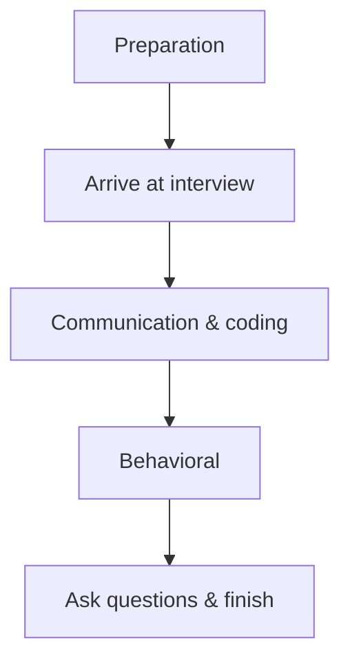

# Chapter 11: Real Experiences & Insights

[Tiếng Việt](index.md)

---

## 1. Real Interview Story

**Example:**
- Candidate A prepared technical skills and practiced coding daily, but was asked about system design and behavioral questions in the interview. Result: did not pass the first round, learned the lesson to prepare comprehensively.

---

## 2. Case Study: A Typical Interview

**Process:**
1. Preparation (CV, portfolio, coding practice, mock interview)
2. Arrive early, dress professionally
3. Communicate confidently, ask for clarification if needed
4. Coding: explain your thought process, write code, test
5. Behavioral: share real stories, answer using STAR
6. Finish: ask about the team, product, request feedback

**Mermaid:**

---

## 3. Advice from Experienced Candidates

- Don't just practice LeetCode, also prepare for system design and behavioral questions.
- Don't hesitate to ask for clarification if the problem is unclear.
- Practice thinking aloud while coding.
- Don't be discouraged by failure, learn from experience and try again.

---

## 4. Interview Do's and Don'ts Checklist

**Do:**
- Practice coding, system design, behavioral
- Prepare questions for the interviewer
- Arrive early, dress appropriately
- Be confident, communicate proactively

**Don't:**
- Arrive late, be unprepared
- Give short answers without explaining your thinking
- Interrupt the interviewer
- Get discouraged by tough questions

---

[Previous: Chapter 10 - Soft Skills & Resume Preparation](../10-soft-skills/en.md) | [Next: Chapter 12 - Recommended Resources & Practice Plan](../12-resources/en.md) 