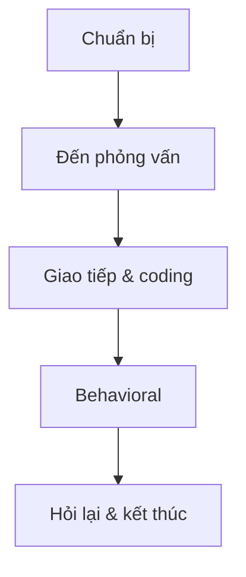

# Chương 11: Kinh nghiệm thực chiến & chia sẻ

[English Version](en.md)

---

## 1. Câu chuyện phỏng vấn thực tế

**Ví dụ:**
- Ứng viên A chuẩn bị kỹ thuật, luyện coding mỗi ngày, nhưng khi phỏng vấn lại bị hỏi về system design và behavioral. Kết quả: không qua vòng đầu, rút ra bài học cần luyện toàn diện.

---

## 2. Case study: Một buổi phỏng vấn điển hình

**Quy trình:**
1. Chuẩn bị (CV, portfolio, luyện coding, mock interview)
2. Đến sớm, trang phục lịch sự
3. Giao tiếp tự tin, hỏi lại khi chưa rõ
4. Coding: giải thích tư duy, viết code, kiểm thử
5. Behavioral: kể câu chuyện thực tế, trả lời theo STAR
6. Kết thúc: hỏi lại về team, sản phẩm, feedback

**Mermaid:**

---

## 3. Lời khuyên từ người đi trước

- Đừng chỉ luyện LeetCode, hãy luyện cả system design, behavioral.
- Đừng ngại hỏi lại khi chưa rõ đề.
- Hãy luyện tập nói to suy nghĩ khi code.
- Đừng nản nếu fail, hãy rút kinh nghiệm và thử lại.

---

## 4. Checklist nên/không nên khi đi phỏng vấn

**Nên:**
- Luyện coding, system design, behavioral
- Chuẩn bị câu hỏi cho interviewer
- Đến sớm, trang phục phù hợp
- Tự tin, chủ động giao tiếp

**Không nên:**
- Đến muộn, thiếu chuẩn bị
- Trả lời qua loa, không giải thích tư duy
- Ngắt lời interviewer
- Nản chí khi gặp câu khó

---

[Previous: Chương 10 - Kỹ năng mềm & chuẩn bị hồ sơ](../10-soft-skills/index.md) | [Next: Chương 12 - Tài nguyên & lộ trình luyện tập](../12-resources/index.md) 