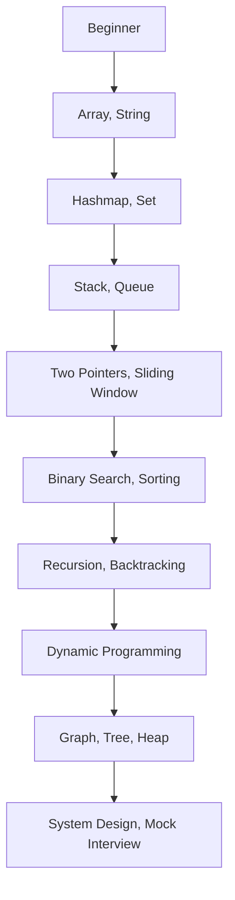

# Chapter 12: Recommended Resources & Practice Plan

[Tiếng Việt](index.md)

---

## 1. Recommended Resources

### Algorithm Practice Websites
- [LeetCode](https://leetcode.com) – Large problem set, discussions, contests
- [HackerRank](https://hackerrank.com) – Many topics, auto-grading
- [Codeforces](https://codeforces.com) – Competitive programming, contests
- [GeeksforGeeks](https://geeksforgeeks.org) – Theory, examples, detailed explanations

### Books
- "Cracking the Coding Interview" – Gayle Laakmann McDowell
- "Elements of Programming Interviews"
- "Grokking Algorithms" – Aditya Bhargava (easy to understand, lots of illustrations)

### Courses/YouTube
- [freeCodeCamp](https://www.youtube.com/c/Freecodecamp) – Algorithm & data structure videos
- [NeetCode](https://www.youtube.com/c/NeetCode) – LeetCode guides, clear roadmap
- [CS50 Harvard](https://cs50.harvard.edu) – Intro to Computer Science

### Communities
- Facebook group: "Luyện Code Phỏng Vấn" (Vietnamese)
- Discord: "LeetCode Việt Nam"
- Reddit: r/leetcode, r/cscareerquestions

---

## 2. Step-by-step Practice Roadmap

**Beginner:**
- Get familiar with arrays, strings, hashmaps, stacks, queues
- Solve 30-50 easy problems on LeetCode

**Intermediate:**
- Learn two pointers, sliding window, binary search, recursion, sorting
- Solve 50-100 medium problems, start joining contests

**Advanced:**
- Dynamic programming, graph, tree, heap, system design
- Solve hard problems, practice mock interviews, real interviews

---

## 3. Case Study: 30-Day Practice Plan

| Day  | Topic                  | Example Problems         |
|------|------------------------|-------------------------|
| 1-5  | Array, String          | Two Sum, Reverse String |
| 6-10 | Hashmap, Set           | Group Anagrams          |
| 11-15| Stack, Queue           | Valid Parentheses       |
| 16-20| Binary Search, Sorting | Search Insert Position  |
| 21-25| Recursion, Backtrack   | Subsets, Permutations   |
| 26-30| DP, Graph, Tree        | Climbing Stairs, BFS    |

**Tips:**
- Pick 1-2 problems per day, read explanations, re-code yourself
- Mark problems you couldn't solve for review
- Join weekend contests to check your progress

---

## 4. Mermaid: Practice Roadmap Diagram

---

## 5. Effective Practice Checklist/Tips

- Set clear goals (number of problems/day, topics)
- Review unsolved problems, understand deeply
- Join communities to ask/answer questions
- Practice mock interviews with friends or online
- Diversify topics, don't focus on just one type
- Don't get discouraged by hard problems, ask and learn from explanations

---

[Previous: Chapter 11 - Real Experiences & Insights](../11-real-experience/en.md) | [Next: Chapter 13 - Appendix](../13-appendix/en.md) 