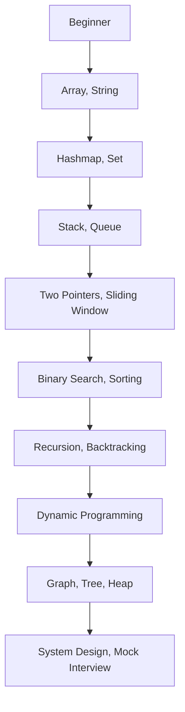

# Chương 12: Tài nguyên khuyến nghị & lộ trình luyện tập

[English Version](en.md)

---

## 1. Danh sách tài nguyên khuyến nghị

### Website luyện thuật toán
- [LeetCode](https://leetcode.com) – Kho bài tập lớn, có thảo luận, contest
- [HackerRank](https://hackerrank.com) – Nhiều chủ đề, có chấm tự động
- [Codeforces](https://codeforces.com) – Thi đấu, luyện tư duy competitive
- [GeeksforGeeks](https://geeksforgeeks.org) – Lý thuyết, ví dụ, giải thích chi tiết

### Sách hay
- "Cracking the Coding Interview" – Gayle Laakmann McDowell
- "Elements of Programming Interviews"
- "Grokking Algorithms" – Aditya Bhargava (dễ hiểu, nhiều hình)

### Khóa học/YouTube
- [freeCodeCamp](https://www.youtube.com/c/Freecodecamp) – Video giải thích thuật toán, data structure
- [NeetCode](https://www.youtube.com/c/NeetCode) – Hướng dẫn giải LeetCode, lộ trình rõ ràng
- [CS50 Harvard](https://cs50.harvard.edu) – Nhập môn khoa học máy tính

### Cộng đồng
- Facebook group: "Luyện Code Phỏng Vấn"
- Discord: "LeetCode Việt Nam"
- Reddit: r/leetcode, r/cscareerquestions

---

## 2. Lộ trình luyện tập từ cơ bản đến nâng cao

**Beginner:**
- Làm quen với array, string, hashmap, stack, queue
- Giải 30-50 bài easy trên LeetCode

**Intermediate:**
- Học kỹ thuật two pointers, sliding window, binary search, recursion, sorting
- Giải 50-100 bài medium, bắt đầu luyện contest

**Advanced:**
- Dynamic programming, graph, tree, heap, system design
- Giải các bài hard, luyện mock interview, phỏng vấn thật

---

## 3. Case study: Lịch luyện tập 30 ngày

| Ngày | Chủ đề                | Ví dụ bài tập           |
|------|-----------------------|-------------------------|
| 1-5  | Array, String         | Two Sum, Reverse String |
| 6-10 | Hashmap, Set          | Group Anagrams          |
| 11-15| Stack, Queue          | Valid Parentheses       |
| 16-20| Binary Search, Sort   | Search Insert Position  |
| 21-25| Recursion, Backtrack  | Subsets, Permutations   |
| 26-30| DP, Graph, Tree       | Climbing Stairs, BFS    |

**Tips:**
- Mỗi ngày chọn 1-2 bài, đọc giải thích, tự code lại
- Đánh dấu bài chưa làm được để ôn lại
- Tham gia contest cuối tuần để kiểm tra tiến bộ

---

## 4. Mermaid: Sơ đồ lộ trình luyện tập

---

## 5. Checklist/tips luyện tập hiệu quả

- Đặt mục tiêu rõ ràng (số bài/ngày, chủ đề)
- Ôn lại bài chưa làm được, hiểu sâu bản chất
- Tham gia cộng đồng để hỏi/được giải đáp
- Luyện mock interview với bạn bè hoặc online
- Đa dạng hóa chủ đề, không chỉ tập trung 1 dạng
- Đừng nản khi gặp bài khó, hãy hỏi và học từ giải thích

---

[Previous: Chương 11 - Kinh nghiệm thực chiến & chia sẻ](../11-real-experience/index.md) | [Next: Chương 13 - Phụ lục](../13-appendix/index.md) 