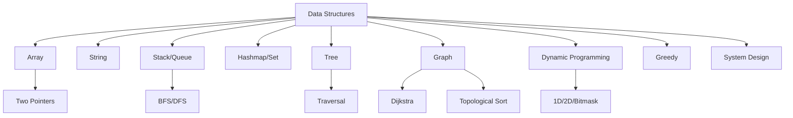

# Chapter 13: Appendix

[Tiếng Việt](index.md)

---

## 1. Big O Complexity Table for Common Algorithms

| Algorithm           | Best Time      | Avg Time        | Worst Time      | Space   |
|---------------------|---------------|-----------------|-----------------|---------|
| Linear Search       | O(1)          | O(n)            | O(n)            | O(1)    |
| Binary Search       | O(1)          | O(log n)        | O(log n)        | O(1)    |
| Bubble Sort         | O(n)          | O(n^2)          | O(n^2)          | O(1)    |
| Merge Sort          | O(n log n)    | O(n log n)      | O(n log n)      | O(n)    |
| Quick Sort          | O(n log n)    | O(n log n)      | O(n^2)          | O(log n)|
| Heap Sort           | O(n log n)    | O(n log n)      | O(n log n)      | O(1)    |
| BFS/DFS (Graph)     | O(V+E)        | O(V+E)          | O(V+E)          | O(V)    |
| Dijkstra            | O(E + V log V)| O(E + V log V)  | O(E + V log V)  | O(V)    |
| DP (Fibonacci)      | O(n)          | O(n)            | O(n)            | O(n)    |

---

## 2. Python Cheat Sheet & Common Code Templates

**For loop:**
```python
for i in range(n):
    # code
```

**While loop:**
```python
while condition:
    # code
```

**Enumerate array:**
```python
for i, val in enumerate(arr):
    # code
```

**DFS template (recursive):**
```python
def dfs(node, visited):
    visited.add(node)
    for neighbor in graph[node]:
        if neighbor not in visited:
            dfs(neighbor, visited)
```

**BFS template:**
```python
from collections import deque
def bfs(start):
    visited = set([start])
    q = deque([start])
    while q:
        node = q.popleft()
        for neighbor in graph[node]:
            if neighbor not in visited:
                visited.add(neighbor)
                q.append(neighbor)
```

**DP template (Fibonacci):**
```python
def fib(n):
    if n <= 1: return n
    dp = [0, 1]
    for i in range(2, n+1):
        dp.append(dp[-1] + dp[-2])
    return dp[n]
```

---

## 3. Case Study: Applying BFS Template for Shortest Path

**Problem:** Find the minimum number of steps from node A to B in an unweighted graph.

**Code Example:**
```python
from collections import deque
def shortest_path(graph, start, end):
    visited = set([start])
    q = deque([(start, 0)])
    while q:
        node, dist = q.popleft()
        if node == end:
            return dist
        for neighbor in graph[node]:
            if neighbor not in visited:
                visited.add(neighbor)
                q.append((neighbor, dist+1))
    return -1
# Example usage:
graph = {0:[1,2], 1:[0,3], 2:[0,3], 3:[1,2]}
print(shortest_path(graph, 0, 3))  # 2
```

---

## 4. Mermaid: Overview Diagram of Algorithm Topics



---

## 5. Summary Tips & Useful Links

- Practice regularly, don't give up on hard problems
- Read explanations, compare multiple solutions
- Reference sample code but always try to code yourself
- Join communities to learn and share

**Useful Links:**
- [Python Cheatsheet](https://www.pythoncheatsheet.org/)
- [Big O Cheat Sheet](https://www.bigocheatsheet.com/)
- [LeetCode Patterns](https://seanprashad.com/leetcode-patterns/)

---

[Previous: Chapter 12 - Recommended Resources & Practice Plan](../12-resources/en.md) 