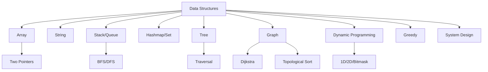

# Chương 13: Phụ lục

[English Version](en.md)

---

## 1. Bảng tổng hợp độ phức tạp các thuật toán

| Thuật toán           | Thời gian (Best) | Thời gian (Avg) | Thời gian (Worst) | Bộ nhớ |
|----------------------|------------------|-----------------|-------------------|--------|
| Linear Search        | O(1)             | O(n)            | O(n)              | O(1)   |
| Binary Search        | O(1)             | O(log n)        | O(log n)          | O(1)   |
| Bubble Sort         | O(n)             | O(n^2)          | O(n^2)            | O(1)   |
| Merge Sort          | O(n log n)       | O(n log n)      | O(n log n)        | O(n)   |
| Quick Sort          | O(n log n)       | O(n log n)      | O(n^2)            | O(log n)|
| Heap Sort           | O(n log n)       | O(n log n)      | O(n log n)        | O(1)   |
| BFS/DFS (Graph)     | O(V+E)           | O(V+E)          | O(V+E)            | O(V)   |
| Dijkstra            | O(E + V log V)   | O(E + V log V)  | O(E + V log V)    | O(V)   |
| DP (Fibonacci)      | O(n)             | O(n)            | O(n)              | O(n)   |

---

## 2. Cheat sheet Python & template code thường dùng

**Vòng lặp for:**
```python
for i in range(n):
    # code
```

**While loop:**
```python
while condition:
    # code
```

**Duyệt mảng với chỉ số và giá trị:**
```python
for i, val in enumerate(arr):
    # code
```

**Template DFS (đệ quy):**
```python
def dfs(node, visited):
    visited.add(node)
    for neighbor in graph[node]:
        if neighbor not in visited:
            dfs(neighbor, visited)
```

**Template BFS:**
```python
from collections import deque
def bfs(start):
    visited = set([start])
    q = deque([start])
    while q:
        node = q.popleft()
        for neighbor in graph[node]:
            if neighbor not in visited:
                visited.add(neighbor)
                q.append(neighbor)
```

**Template DP (Fibonacci):**
```python
def fib(n):
    if n <= 1: return n
    dp = [0, 1]
    for i in range(2, n+1):
        dp.append(dp[-1] + dp[-2])
    return dp[n]
```

---

## 3. Case study: Áp dụng template BFS tìm đường đi ngắn nhất

**Bài toán:** Tìm số bước ít nhất từ node A đến B trong đồ thị không trọng số.

**Code mẫu:**
```python
from collections import deque
def shortest_path(graph, start, end):
    visited = set([start])
    q = deque([(start, 0)])
    while q:
        node, dist = q.popleft()
        if node == end:
            return dist
        for neighbor in graph[node]:
            if neighbor not in visited:
                visited.add(neighbor)
                q.append((neighbor, dist+1))
    return -1
# Ví dụ sử dụng:
graph = {0:[1,2], 1:[0,3], 2:[0,3], 3:[1,2]}
print(shortest_path(graph, 0, 3))  # 2
```

---

## 4. Mermaid: Sơ đồ tổng quan các chủ đề thuật toán



---

## 5. Tips tổng kết & link hữu ích

- Luôn luyện tập đều đặn, không bỏ cuộc khi gặp bài khó
- Đọc giải thích, so sánh nhiều cách giải
- Tham khảo code mẫu nhưng nên tự code lại
- Tham gia cộng đồng để học hỏi, chia sẻ

**Link hữu ích:**
- [Python Cheatsheet](https://www.pythoncheatsheet.org/)
- [Big O Cheat Sheet](https://www.bigocheatsheet.com/)
- [LeetCode Patterns](https://seanprashad.com/leetcode-patterns/)

---

[Previous: Chương 12 - Tài nguyên & lộ trình luyện tập](../12-resources/index.md) 